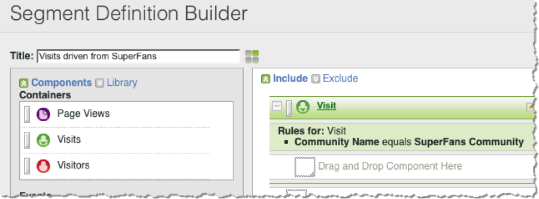

# Segmenting by Dynamic Signal Dimensions{#segmenting-by-dynamic-signal-dimensions}

Ejemplos de segmentos basados en dimensiones de señal dinámica.

Una función principal de esta integración es la capacidad de crear segmentos de Adobe Analytics basándose en las dimensiones de informes integradas. Por ejemplo, puede generar un segmento que incluya sólo Visitas provenientes de una comunidad de voicestorm específica. Puede llamar a esta «Visitas dirigidas desde Superseguidores». Esta definición de segmento puede tener el aspecto siguiente.

