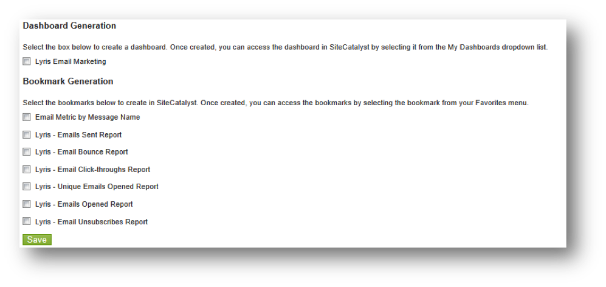

# Completing the Integration Wizard{#completing-the-integration-wizard}

Pasos para utilizar el asistente para integración.

Para activar la integración, debe completar el asistente de integración de Lyris dentro de la interfaz de Data Connectors.

1. Vaya al área Conectores de datos (anteriormente Genesis) dentro de Adobe Marketing Cloud.

   

1. Under **[!UICONTROL Add Integration]**, drag and drop the Lyris plugin into the Adobe Marketing Cloud. Esto abre la integración del Conector de datos Lyris.

   

1. Under **[!UICONTROL General Settings]**, choose the desired Report Suite and provide a name for the integration.
1. Fill in all your Lyris account-related information under **[!UICONTROL Custom Values]**.

   

1. Elija las evars y los eventos reservados adecuados en los menús desplegables.

   

1. You may choose your own segments under **[!UICONTROL Your Segments]** - apart from the 3 automated Partner segments.
1. Es posible que esta integración requiera descargar algunos datos en su cuenta de Lyris. You may choose to give access for this under **[!UICONTROL Access Request]**.
1. Under **[!UICONTROL Data Collection]**, you can choose to have an automated or a manual solution (JavaScript Plug-in) to collect query string parameters from the landing page URL. Si decide tener una solución automatizada, introduzca el parámetro de cadena de consulta para ID de mensaje y ID de destinatario. Para obtener un complemento de JavaScript, póngase en contacto con su consultor de Adobe.

   

1. Puede elegir que los marcadores de Lyris se generan automáticamente.

   

1. Review the integration summary and click **[!UICONTROL Activate]**.
