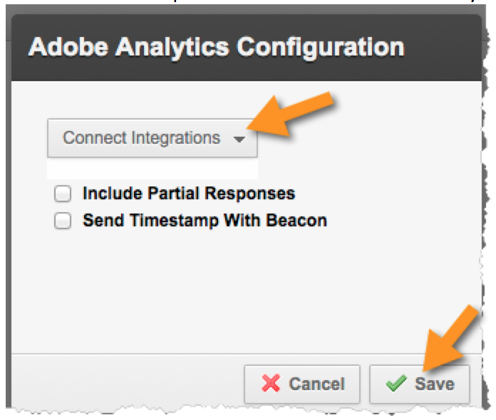

# Enabling the Integration in Qualtrics Research Suite{#enabling-the-integration-in-qualtrics-research-suite}

Después de completar el asistente para integración, debe activar la integración de cada estudio Qualtrics que desee conectar.

1. Inicie sesión en Qualtrics Research Suite.
1. On the **[!UICONTROL My Surveys]** tab, click the **[!UICONTROL Edit]** button for the survey that you want to integrate.
1. Click the **[!UICONTROL Advanced Options]** menu and select **[!UICONTROL Adobe Analytics]**. (si no ve esta opción, pida a su administrador que obtenga los permisos necesarios).

   

1. Select the Adobe Analytics Configuration, then click **[!UICONTROL Save]**. Si no hay configuraciones disponibles, es probable que aún no haya completado el Asistente para integración de Adobe.
   1. The **[!UICONTROL Include Partial Responses]** checkbox can be used to indicate that you’d like to capture data into Adobe Analytics after each partial survey screen is completed. Si no se selecciona, los datos se transfieren únicamente para estudios totalmente completados.
   1. The **[!UICONTROL Send Timestamp With Beacon]** checkbox should be used only when integrating with a Report Suite that is configured to receive time-stamped data (not common).
   

