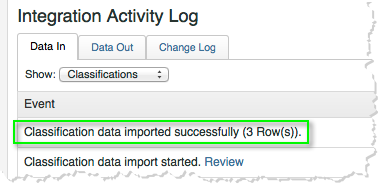

# Verifying the Integration{#verifying-the-integration}

Una vez completados todos los pasos de implementación, puede validar que la integración esté transfiriendo correctamente los datos.

1. **Registro de actividades de integración**: En la interfaz de usuario de Conectores de datos, vea la ficha **[!UICONTROL Compatibilidad]** en la integración Qualtrics. Under the heading **[!UICONTROL Integration Activity Log]** you should see entries stating successful classification data imported.

   >[!NOTE]
   >
   >Estas entradas deben aparecer en un plazo de 1 hora tras la correcta implementación.

   

1. **Datos de informes**: Vea los informes de la encuesta Qualtrics con la IU de informes y análisis de marketing navegando por los informes de la encuesta Qualtrics (en **[!UICONTROL Variables de lista]**).

   >[!NOTE]
   >
   >Estos datos deben aparecer entre 24 y 48 horas después de la implementación exitosa, suponiendo que el estudio integrado está recibiendo respuestas activamente.

    

