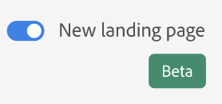
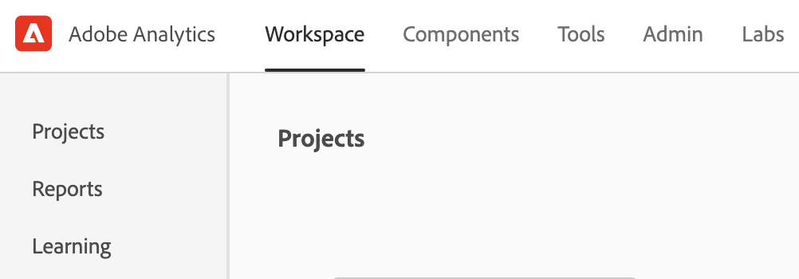

# Nueva página de aterrizaje de Adobe Analytics

La nueva página de aterrizaje para Adobe Analytics reúne tanto Analysis Workspace como Reports &amp; Analytics en una sola interfaz y punto de acceso bajo el paraguas de Workspace. Incluye una nueva página de inicio del administrador de proyectos, un menú de informes actualizado, informes modernizados y una nueva sección de aprendizaje para ayudarle a empezar de forma más eficaz.

La nueva página mejora la capacidad de detección y guía a los usuarios de Reports &amp; Analytics para mejorar la experiencia de generación de informes en Workspace.

>[!IMPORTANT]
>
>Esta página de aterrizaje estará en la versión beta abierta a partir del 21 de julio de 2021. Es un punto de partida opcional. Si lo prefiere, puede utilizar la página de aterrizaje existente, ya sea la de Workspace o Reports. Si decide unirse al programa beta, acceda a la página y haga clic en **[!UICONTROL Proporcionar comentarios]** en la parte superior de la pantalla para registrar sus comentarios y los errores que pueda encontrar. Puede desactivar y volver a iniciar el programa beta en cualquier momento. Cualquier trabajo realizado en la interfaz de usuario beta se transfiere a la experiencia existente o actual de Workspace.

## Acceso a la nueva página de aterrizaje {#access-landing}

Después de iniciar sesión en Adobe Experience Cloud y Analytics, active el botón de alternancia [!UICONTROL New landing page - Beta] en la esquina inferior izquierda. El acceso al botón de alternancia es específico del usuario por organización, no por empresa.

## Observe la nueva estructura de menú

El menú superior y el carril izquierdo han cambiado.

* Cambios principales en el menú de Analytics: El menú superior **[!UICONTROL Reports]** ya no está ahí. La mayoría de los informes se encuentran ahora en el menú [!UICONTROL Reports] en el carril izquierdo.
* El carril izquierdo tiene tres pestañas: [!UICONTROL Proyectos], [!UICONTROL Informes] y [!UICONTROL Aprendizaje]. Discutimos cada uno de ellos con más detalle en las siguientes secciones.

### Terminología

Tenga en cuenta algunos cambios en la terminología:

* **** Los proyectos son cosas que ha creado o que otra persona ha creado y compartido con usted.  Los proyectos también hacen referencia a proyectos en blanco y a informes de valoración móviles en blanco.
* **** Informes hace referencia a todo lo que haya creado previamente el Adobe, como los informes de Reports &amp; Analytics y las plantillas de Workspace.  Los informes también son plantillas de informes que su empresa ha creado para usted.
* **** Las plantillas ya no se usan como término para los proyectos de Workspace precreados de Adobe. Ahora se encuentran en [!UICONTROL Reports].

## Vaya a la pestaña [!UICONTROL Proyectos] {#navigate-projects}

 Los proyectos sirven como página de inicio de   Workspace. Aquí se muestra cualquier proyecto de Workspace, incluidos los informes de valoración móviles.

>[!NOTE]
>
>Varias de las siguientes configuraciones persisten (se recuerdan) durante la sesión y entre sesiones. Ejemplos: En qué ficha se encuentra, qué filtros se seleccionaron, qué columnas se seleccionaron y la dirección de clasificación de columnas. Sin embargo, los resultados de la búsqueda no se mantienen.

| Elemento de la interfaz de usuario | Definición |
| --- | --- |
| ... Más | Le permite [!UICONTROL Ver Tutorials] y [Editar preferencias de usuario](/help/analyze/analysis-workspace/user-preferences.md). |
| Crear proyecto | El menú desplegable permite crear un [!UICONTROL proyecto de Workspace] o un [!UICONTROL proyecto móvil]. |
| Mostrar menos/más | Alterna entre no mostrar y mostrar el banner:  |
| Proyecto en blanco | Crea un [proyecto de Workspace](https://experienceleague.adobe.com/docs/analytics/analyze/analysis-workspace/home.html?lang=es) en blanco para que lo rellene. |
| Cuadro de resultados móvil en blanco | Crea un [informe de valoración móvil](https://experienceleague.adobe.com/docs/analytics/analyze/mobapp/curator.html?lang=en) en blanco para que lo rellene. |
| Tutorial de formación abierta | Abre el tutorial de formación de Workspace que guía a los nuevos usuarios mediante la creación de un proyecto paso a paso. |
| Abrir notas de la versión | Abre la sección Adobe Analytics de las últimas notas de la versión de Adobe Experience Cloud. |
| Icono de filtro | Puede filtrar por etiquetas, grupos de informes, propietarios, tipos y otros filtros (Míos, Compartidos conmigo, Favoritos y Aprobados) |
| Barra de búsqueda | La búsqueda ahora incluye todas las columnas de la tabla. |
| Cuadro de selección | Al hacer clic en este cuadro junto a uno o varios proyectos, se muestran las acciones de administración de proyectos que puede realizar: Eliminar, etiquetar, fijar, aprobar, compartir, cambiar el nombre, copiar y exportar a CSV. Es posible que no tenga permisos para realizar todas estas acciones. |
| Favoritos | Al marcar como favorito un proyecto, se coloca una estrella por ella y se etiqueta como favorito con el que se puede filtrar. |
| Nombre | Nombre del proyecto. |
| Icono de anclaje | **** NuevoAhora puede fijar elementos que  ** siempre aparecen en la parte superior de la lista. |
| Icono de información (i) | Al hacer clic en el icono de información, se muestra la siguiente información sobre este proyecto: Escriba, función del proyecto, propietario, descripción y con quién se comparte. También indica quién puede [editar o duplicar](https://experienceleague.adobe.com/docs/analytics/analyze/analysis-workspace/curate-share/share-projects.html?lang=es) este proyecto. |
| Elipsis (...) | Al hacer clic en los puntos suspensivos junto a un proyecto, se muestran las acciones de administración de proyectos que puede realizar: Eliminar, etiquetar, fijar, aprobar, compartir, cambiar el nombre, copiar y exportar a CSV. Tenga en cuenta que es posible que no tenga permisos para realizar todas estas acciones. |
| Tipo | Indica si este tipo es un proyecto de Workspace o un informe de valoración móvil. |
| Etiquetas | Los informes se pueden etiquetar para organizarlos en grupos. |
| Función del proyecto | Las funciones de proyecto hacen referencia a si es el propietario del proyecto y si tiene permisos para editar o duplicar el proyecto. |
| Grupo de informes | Las tablas y visualizaciones de un panel derivan datos del grupo de informes seleccionado en la parte superior derecha del panel. El grupo de informes también determina qué componentes están disponibles en el carril izquierdo. Dentro de un proyecto, puede utilizar uno o varios grupos de informes en función de los casos de uso del análisis. La lista de grupos de informes se ordena según la relevancia. El Adobe define la relevancia en función de la frecuencia con la que el usuario actual ha utilizado el grupo y la frecuencia con la que se utiliza dentro de la organización. |
| Propietario | La persona que creó el proyecto. |
| Última apertura | La última vez que abrió este proyecto. |
| Selector de columnas | Si desea agregar o quitar columnas de la lista de proyectos, puede seleccionarlas o anularlas. |
| &lt;> | Este botón de un proyecto de Workspace o de un informe le devuelve a la configuración de la página de aterrizaje más reciente. Cualquier configuración de página que tuviera al salir de la página de aterrizaje persistirá cuando vuelva. |

## Vaya a la pestaña [!UICONTROL Reports] {#navigate-reports}

La pestaña [!UICONTROL Reports] consolida tres conjuntos de informes:

* Las plantillas prediseñadas de [!UICONTROL Workspace] que anteriormente se encontraban en [!UICONTROL Workspace] > [!UICONTROL Proyecto] > [!UICONTROL Nuevo]. Adobe ya no utiliza la palabra &quot;template&quot; en este contexto.
* La mayoría de los informes pregenerados en el menú superior anterior de Adobe Analytics [!UICONTROL Reports]. Estos informes ahora se muestran en [Analysis Workspace](https://experienceleague.adobe.com/docs/analytics/analyze/analysis-workspace/home.html?lang=en).
* Cualquier cosa que tu compañía haya construido para ti.

>[!IMPORTANT]
>
>En Informes, la carpeta Favoritos aparece únicamente si marca un nuevo informe como favorito. No se arrastran los favoritos preexistentes de Reports &amp; Analytics.

Como se ha mencionado anteriormente, solo están disponibles aquí los informes más utilizados que antes se agrupaban en Reports &amp; Analytics. No se migraron algunos informes raramente usados o que ya no son relevantes. Consulte las preguntas más frecuentes a continuación para obtener más información.

Aquí están los nuevos menús y sus submenús. Si no encuentra un informe específico, haga una &quot;Búsqueda en la página&quot; para encontrarlo.

| Elemento del menú | Informes bajo este elemento de menú |
| --- | --- |
| **[!UICONTROL Más populares]** | <ul><li>Tutorial de formación (plantilla de Workspace preexistente)</li><li>Páginas (¿Cuáles son mis páginas principales?)</li><li>Vistas de página (¿Cuántas vistas de página genero?)</li><li>Visitas (¿Cuántas visitas obtengo?)</li><li>Visitantes (¿Cuántos visitantes recibo?)</li><li>Métricas clave (¿Qué rendimiento tienen mis métricas más importantes?)</li><li>Secciones del sitio (¿Qué secciones de mi sitio generaron la mayor cantidad de vistas de página?</li><li>Página siguiente (¿Cuáles son las páginas siguientes a las que van mis visitantes?)</li><li>Página anterior (¿Cuáles son las páginas anteriores a las que se dirigieron mis visitantes?)</li><li>Campañas (¿Qué campañas están impulsando mis métricas clave?)</li><li>Productos (¿Qué productos están impulsando mis métricas clave?)</li><li>Canal de último contacto (¿Qué canal de último contacto tiene el mejor rendimiento?</li><li>Detalles del canal de último contacto (¿Qué canal de último contacto específico supera a los demás?)</li><li>Ingresos (¿Cómo funcionan mis ingresos?)</li><li>Pedidos (¿Cómo funcionan mis pedidos?)</li><li>Unidades (¿Cuántas unidades vendo?)</li></ul> |
| **[!UICONTROL Participación]** | <ul><li>Métricas clave (¿Qué rendimiento tienen mis métricas más importantes?)</li><li>Vistas de página (¿Cuántas vistas de página genero?)</li><li>Páginas (¿Cuáles son mis páginas principales?)</li><li>Visitas (¿Cuántas visitas obtengo?)</li><li>Visitantes (¿Cuántos visitantes recibo?)</li><li>Tiempo empleado por visita (cuánto tiempo invierten mis usuarios por visita)</li><li>Tiempo previo al evento (¿Cuánto tiempo dedican mis usuarios antes de un evento de éxito?)</li><li>Secciones del sitio (¿Qué secciones de mi sitio generaron la mayor cantidad de vistas de página?</li><li>Consumo de contenido web (¿qué contenido se consume más y resulta más atractivo para los usuarios?)</li><li>Consumo de contenido multimedia (¿qué contenido se consume más y resulta más atractivo para los usuarios?)</li><li>Flujo de página siguiente y anterior (¿Cuáles son/fueron las rutas siguientes/anteriores que siguen/siguen mis visitantes?)</li><li>Visitas en el orden previsto (¿Dónde veo las visitas en el orden previsto a través de mis propiedades digitales?)</li><li>Análisis entre dispositivos (uso del análisis entre dispositivos en Analysis Workspace)</li><li>Retención web (¿Quiénes son mis usuarios más fieles y qué hacen?)</li><li>Consumo de audio de medios (¿Cuáles son las tendencias y las principales métricas de consumo de audio?)</li><li>Actualización de los medios, frecuencia, lealtad (¿Quiénes son mis lectores más fieles?)</li><li>Análisis de página > Recargas (¿Qué páginas generan la mayor cantidad de recargas?)</li><li>Análisis de página > Tiempo empleado en la página (¿Cuánto tiempo dedican mis usuarios a mis páginas?)</li><li>Entradas y salidas > Páginas de entrada (¿Cuáles son mis páginas de entrada principales?)</li><li>Entradas y salidas > Páginas de entrada originales (¿Desde qué página entró mi visitante originalmente?)</li><li>Entradas y salidas > Visitas de página única (¿Qué páginas generaron la mayor cantidad de visitas de página única?)</li><li>Entradas y salidas > Páginas de salida (¿Cuáles son mis páginas de salida principales?)</li></ul> |
| **[!UICONTROL Conversión]** | <ul><li>Productos > Productos (¿Qué productos están impulsando mis métricas clave?)</li><li>Productos > Rendimiento del producto (¿Qué productos tienen el mejor rendimiento?)</li><li>Productos > Categorías (¿Cuáles son mis categorías de productos de mejor rendimiento?</li><li>Carro de compras > Carros de compras (cuántos usuarios agregaron un producto al carro de compras)</li><li>Carro de compras > Vistas del carro de compras (¿Cuántas veces vieron mis visitantes sus carros de compras?)</li><li>Carro de compras > Adiciones al carro de compras (¿Con qué frecuencia los usuarios agregan un producto al carro de compras?)</li><li>Carro de compras > Eliminaciones del carro de compras (¿Con qué frecuencia los usuarios eliminan un producto de su carro de compras?)</li><li>Compras > Ingresos (¿Cómo funcionan mis ingresos?)</li><li>Compras > Pedidos (¿Cómo funcionan mis pedidos?)</li><li>Compras > Unidades (¿Cuántas unidades vendo?)</li><li>[Magento: marketing y comercio](https://experienceleague.adobe.com/docs/analytics/analyze/analysis-workspace/build-workspace-project/starter-projects.html?lang=en#commerce)</li></ul> |
| **[!UICONTROL Audiencia]** | <ul><li>Métrica Personas (¿Cuántas personas están interactuando con mi marca?)</li><li>Perfil del visitante > Información general sobre la ubicación (Qué ubicaciones son las que más utilizan los usuarios)</li><li>Perfil del visitante > Segmentación geográfica > Condados geográficos, Estados de EE. UU. geográficos, Regiones geográficas, Ciudades geográficas, DMA de EE. UU. geográfico (¿De qué geografías están visitando mis usuarios?)</li><li>Perfil del visitante > Idiomas (¿Qué idioma prefieren mis usuarios?)</li><li>Perfil del visitante > Zonas horarias (¿De qué zonas horarias están visitando mis usuarios?)</li><li>Perfil del visitante > Dominios (¿Qué ISP utilizan los visitantes para acceder a mi sitio?)</li><li>Perfil del visitante > Dominios de nivel superior (¿Qué dominios conducen el tráfico a mi sitio?)</li><li>Perfil del visitante > Tecnología > Descripción general de la tecnología (¿Qué tecnologías utilizan los visitantes para acceder a mi sitio?)</li><li>Perfil del visitante > Tecnología > Exploradores, Tipo de explorador, Anchura del explorador, Altura del explorador (¿Qué navegador de la empresa, versión del explorador y ancho y alto utilizan las personas para acceder a mi sitio?)</li><li>Perfil del visitante > Tecnología > Sistema operativo, tipos de sistema operativo (¿Qué sistema operativo y qué versión de él usan mis visitantes?)</li><li>Perfil del visitante > Tecnología > Operador de telefonía móvil (¿Qué operadores de telefonía móvil utilizan los visitantes para acceder a mi sitio?)</li><li>Retención de visitantes > Frecuencia de retorno (¿Cuánto tiempo transcurre entre la visita actual del usuario y las visitas anteriores?)</li><li>Retención de visitantes > Visitas de retorno (¿Cuántas de mis visitas regresan a los usuarios?)</li><li>Retención de visitantes > Número de visitas (Qué bloque de número de visitas genera la mayoría de mis métricas clave)</li><li>Retención de visitantes > Ciclo de ventas > Lealtad del cliente (¿A qué segmento de lealtad pertenecen mis usuarios?)</li><li>Retención de visitantes > Ciclo de ventas > Días antes de la primera compra (¿Cuántos días transcurrieron entre la primera visita de mis usuarios y su primera compra?)</li><li>Retención de visitantes > Ciclo de ventas > Días transcurridos desde la última compra (¿Cuántos días han transcurrido entre la visita actual de mis usuarios y la última compra?) )</li><li>Retención de visitantes > Móvil > Dispositivos y tipos de dispositivos (¿Qué dispositivos y tipos de dispositivos utilizan mis visitantes?)</li><li>Retención de visitantes > Móvil > Fabricante (¿Qué fabricante de dispositivo móvil usan mis visitantes?)</li><li>Retención de visitantes > Móvil > Tamaño de la pantalla, Altura de la pantalla, Anchura de la pantalla (¿Qué tamaño/altura/anchura de la pantalla móvil tienen mis visitantes?)</li><li>Retención de visitantes > Móvil > [Uso de aplicaciones móviles](https://experienceleague.adobe.com/docs/analytics/analyze/analysis-workspace/build-workspace-project/starter-projects.html?lang=en#mobile)</li><li>Retención de visitantes > Móvil > [recorridos de aplicaciones móviles](https://experienceleague.adobe.com/docs/analytics/analyze/analysis-workspace/build-workspace-project/starter-projects.html?lang=en#mobile)</li><li>Retención de visitantes > Móvil > [Métricas de aplicaciones móviles](https://experienceleague.adobe.com/docs/analytics/analyze/analysis-workspace/build-workspace-project/starter-projects.html?lang=en#mobile)</li><li>Retención de visitantes > Móvil > [Mensajería de aplicaciones móviles](https://experienceleague.adobe.com/docs/analytics/analyze/analysis-workspace/build-workspace-project/starter-projects.html?lang=en#mobile)</li><li>Retención de visitantes > Móvil > [Rendimiento de las aplicaciones móviles](https://experienceleague.adobe.com/docs/analytics/analyze/analysis-workspace/build-workspace-project/starter-projects.html?lang=en#mobile)</li><li>Retención de visitantes > Móvil > [Retención de aplicaciones móviles](https://experienceleague.adobe.com/docs/analytics/analyze/analysis-workspace/build-workspace-project/starter-projects.html?lang=en#mobile)</li></ul> |
| **[!UICONTROL Adquisición]** | <ul><li>Canales de marketing > Canal de primer contacto, Detalles de canal de primer contacto (¿Qué canal de primer contacto y qué canal de primer contacto específico está teniendo el mejor rendimiento?)</li><li>Canales de marketing > Primer canal, Último canal detalle (¿Qué canal de último contacto y qué canal de último contacto específico está teniendo el mejor rendimiento?)</li><li>Campañas > Campañas (¿Qué campañas están impulsando mis métricas clave?)</li><li>Campañas > Rendimiento de la campaña (¿Qué campañas consiguen el máximo de ingresos?)</li><li>Campañas > Código de seguimiento (¿Qué códigos de seguimiento de campaña funcionan mejor?)</li><li>[Adquisición web](https://experienceleague.adobe.com/docs/analytics/analyze/analysis-workspace/build-workspace-project/starter-projects.html?lang=en#web)</li><li>[Adquisición móvil](https://experienceleague.adobe.com/docs/analytics/analyze/analysis-workspace/build-workspace-project/starter-projects.html?lang=en#mobile)</li><li>[Advertising Analytics: búsqueda de pago](https://experienceleague.adobe.com/docs/analytics/analyze/analysis-workspace/build-workspace-project/starter-projects.html?lang=en#advertising)</li><li>Palabras clave de búsqueda: todas, pagadas, naturales (¿Qué palabras clave de búsqueda y palabras clave de búsqueda pagada/natural impulsan mejor mis métricas clave?)</li><li>Motores de búsqueda: todos, de pago, naturales (¿Qué motores de búsqueda y motores de búsqueda de pago/natural impulsan mejor mis métricas clave?)</li><li>Clasificación de todas las páginas de búsqueda (¿De qué página de búsqueda están visitando mis usuarios?)</li><li>Dominios de referencia (¿Qué dominios conducen el tráfico a mi sitio?)</li><li>Dominios de referencia originales (¿Cuál fue el primer dominio en el que se encontraban los usuarios antes de visitar mi sitio?)</li><li>Referentes (¿En qué direcciones URL se encontraban mis usuarios antes de hacer clic en mi sitio?)</li><li>Tipos de referentes (a qué categoría pertenecen mis direcciones URL de referencia)</li></ul> |
| **[!UICONTROL Informes de la compañía]** | Informes que su empresa ha creado para su uso. |

### Uso de la ficha Informes

Para los usuarios actuales de Reports &amp; Analytics, aquí tiene una breve introducción sobre cómo utilizar los informes a los que está acostumbrado y que ahora se muestran en Workspace. Los informes funcionan como plantillas existentes: si realiza cambios en ellos, se le pedirá que guarde o descarte los cambios al desplazarse fuera o a otro informe. Y si desea guardar los cambios, guarda el informe como un nuevo proyecto.

1. Vaya a la pestaña [!UICONTROL Reports].
1. Seleccione el informe que desee ver, por ejemplo, en [!UICONTROL Más popular], seleccione el informe [!UICONTROL Páginas].
1. A la derecha, haga clic en **[!UICONTROL Abrir informe]**.

   

1. El informe Páginas, tal como se muestra en Analysis Workspace, muestra dos [visualizaciones](/help/analyze/analysis-workspace/visualizations/freeform-analysis-visualizations.md) ([Gráfico de barras](/help/analyze/analysis-workspace/visualizations/bar.md) y [Número de resumen](/help/analyze/analysis-workspace/visualizations/summary-number-change.md)) y una [Tabla de forma libre](/help/analyze/analysis-workspace/visualizations/freeform-table/freeform-table.md). La métrica utilizada es Ocurrencias.
1. Desde aquí tiene varias opciones. Estas son algunas de estas opciones:

   * Puede usar el informe tal cual.
   * Puede arrastrar uno o más segmentos a la zona de colocación de Segmento en la parte superior. Por ejemplo, arrastre el segmento [!UICONTROL Clientes móviles] y observe cómo cambian los resultados.
   * Puede cambiar el intervalo de fechas yendo al calendario en la parte superior derecha.
   * Puede agregar desgloses de dimensión, arrastrar otras métricas y, por lo general, personalizar el informe de la manera que desee.

Más opciones de aprendizaje:

* Tenga en cuenta que puede acceder a un vídeo de información general de Analysis Workspace de 20 minutos en la parte superior izquierda de cualquier informe que abra.
* Para nuevos usuarios, recomendamos el vídeo del [Tutorial de formación](https://www.youtube.com/watch?v=lCH1Kl1q9Wk) que lo acompaña durante la creación de un nuevo proyecto.
* Aquí tiene un enlace a la [documentación completa de Analysis Workspace](/help/analyze/analysis-workspace/home.md).
* Esta es la [lista de reproducción completa de YouTube para Analysis Workspace](https://www.youtube.com/playlist?list=PL2tCx83mn7GuNnQdYGOtlyCu0V5mEZ8sS).

## Vaya a la pestaña Aprendizaje {#navigate-learning}

La página Aprendizaje contiene tutoriales y giras de vídeo prácticas, además de enlaces a documentación.

## Navegación por la nueva página

* La visita [!UICONTROL Conceptos básicos del espacio de trabajo] le lleva directamente a Workspace y le explica el diseño del espacio de trabajo y dónde encontrar y realizar las acciones más comunes. Esta visita también se puede reiniciar en cualquier momento directamente en Workspace mediante la ventana emergente de información del panel del encabezado.

* Al hacer clic en un vídeo/tour se agrega una etiqueta **[!UICONTROL Visto]**. Esta etiqueta le ayuda a realizar un seguimiento del progreso a través del contenido de aprendizaje. Puede hacer clic en la etiqueta y desaparece, en caso de que aún no haya completado el contenido.

* El botón **[!UICONTROL Más información]** del modal de vídeo le lleva a una página de documentación de Adobe Experience League con más contenido de ayuda relacionado con el vídeo que acaba de ver.  **[!UICONTROL Puede ver más]** apuestas en la lista de reproducción completa de Analysis Workspace YouTube.

## Preguntas frecuentes sobre la nueva página de aterrizaje {#landing-faq}

| Pregunta | Respuesta |
| --- | --- |
| ¿Dónde están las plantillas que estoy acostumbrado a ver en Workspace? | Estas plantillas se agrupan en la pestaña [!UICONTROL Reports]. |
| ¿Puedo desactivar la versión beta? | Puede desactivar la versión beta en cualquier momento. |
| ¿El trabajo que hago en la interfaz de usuario del programa beta se transfiere a la experiencia del espacio de trabajo de producción? | Sí, cualquier trabajo realizado en la versión beta se transfiere a la experiencia antigua/actual de Workspace. |
| ¿Se transfieren mis favoritos actuales de Reports &amp; Analytics? | No, NO se llevan adelante. Sin embargo, todos los favoritos de Workspace Project se transfieren. |
| ¿Hay un número máximo de proyectos que pueda fijar? | No, no hay límite en el número de proyectos que puede fijar. |
| ¿Pueden los administradores designar esta nueva página de aterrizaje para sus usuarios? | No, los administradores no pueden designar la nueva página de aterrizaje en nombre de los usuarios. Los usuarios individuales deben activar la opción ellos mismos. |
| ¿Siguen estando disponibles todos los informes que existen actualmente en Reports &amp; Analytics? | No, los siguientes informes se eliminaron gradualmente según los datos de uso general: <ul><li>Cualquier eVar, props, eventos o clasificaciones personalizados<li>Informes recomendados</li><li>Visitantes únicos por hora/diarios/semanales/mensuales/trimestrales/anuales</li><li>Clientes únicos diarios semanales/mensuales/trimestrales/anuales</li><li>Profundidad del nombre de la acción</li><li>Resumen del nombre de la acción</li><li>Añadir tablero</li><li>Edad</li><li>Compatibilidad con audio</li><li>Información de facturación</li><li>Clics hasta la página</li><li>Profundidad de color</li><li>Compatibilidad con cookies</li><li>Cookies</li><li>Tipos de conexión</li><li>Elementos creativos</li><li>Tipo de tarjeta de crédito</li><li>Venta cruzada</li><li>Canales de eventos personalizados</li><li>Vínculos personalizados</li><li>Customer ID</li><li>Día de la semana</li><li>Nombre de la acción de entrada</li><li>Nombre de la acción de salida</li><li>Vínculos de salida</li><li>Abandono</li><li>Descargas de archivos</li><li>Buscar en tienda</li><li>Rutas completas</li><li>Sexo</li><li>Tipo de visita Regla VISTA</li><li>Compatibilidad con imágenes</li><li>Java</li><li>JavaScript</li><li>JavaScript versión</li><li>Administrar marcadores</li><li>Administrar tableros</li><li>Profundidad de color del monitor</li><li>Resoluciones de monitor</li><li>Suscripciones al boletín</li><li>Nombre de la acción siguiente</li><li>Flujo de nombre de acción siguiente</li><li>Búsquedas nulas</li><li>Sistema operativo</li><li>Revisión del pedido</li><li>Página del día</li><li>Páginas no encontradas</li><li>Pathfinder</li><li>Longitud de ruta</li><li>Nombre de la acción anterior</li><li>Flujo de nombre de acción anterior</li><li>Actividad del producto</li><li>Coste del producto</li><li>Departamento de productos</li><li>Categoría de inventario de productos</li><li>Nombre del producto</li><li>Opiniones del producto</li><li>Temporada del producto</li><li>Recursos compartidos de productos</li><li>Zoom de producto</li><li>Recarga</li><li>Búsquedas</li><li>Servidores</li><li>Visitas de página única</li><li>Información de envío</li><li>Jerarquía del sitio</li><li>Menciones en redes sociales</li><li>Hora del día</li><li>Tiempo empleado en el nombre de la acción</li><li>Compatibilidad con vídeo</li><li>Estado del visitante</li></ul> |
