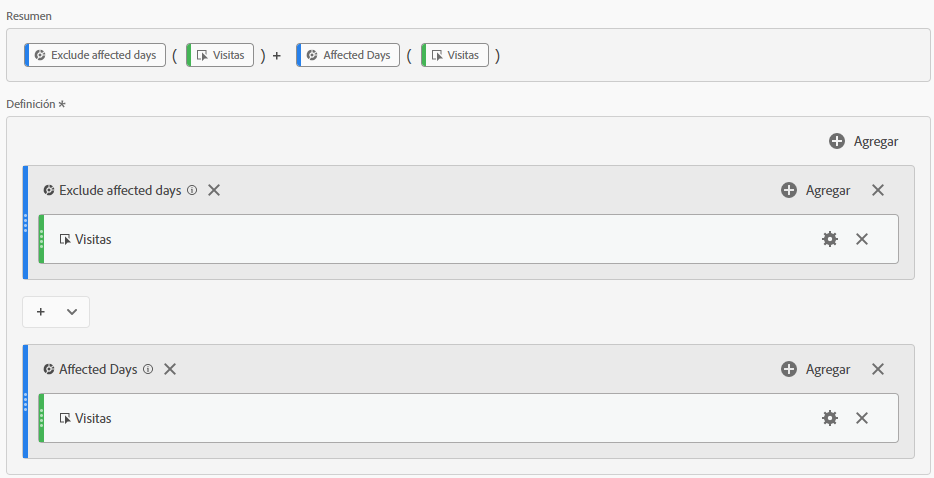
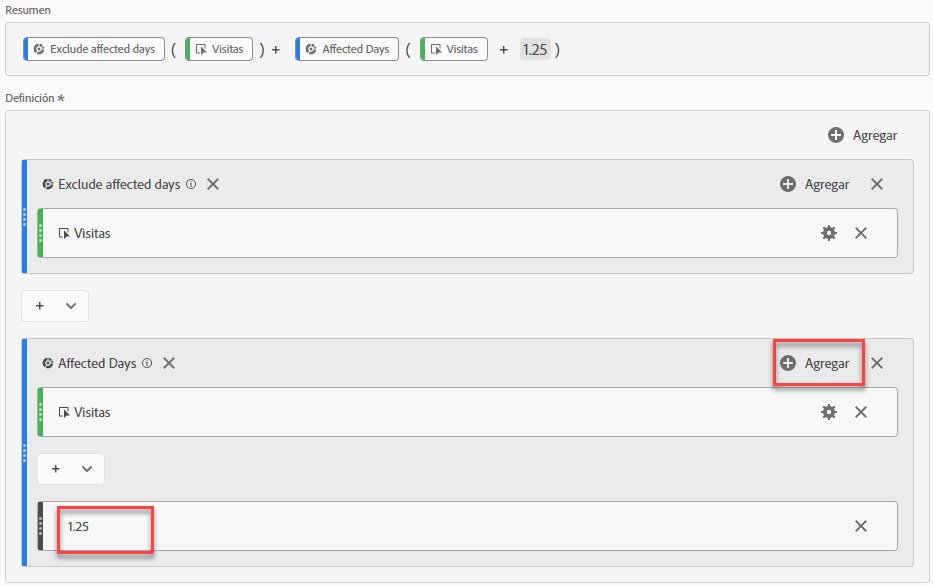
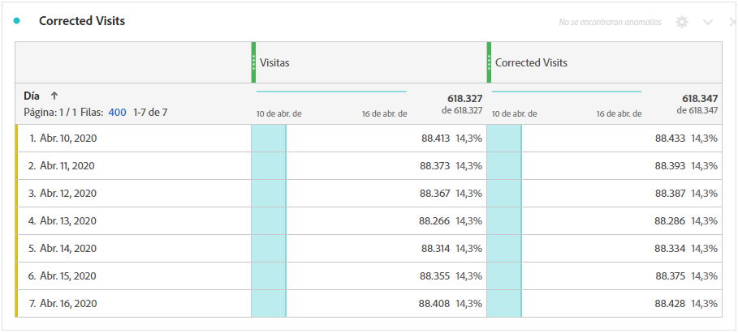
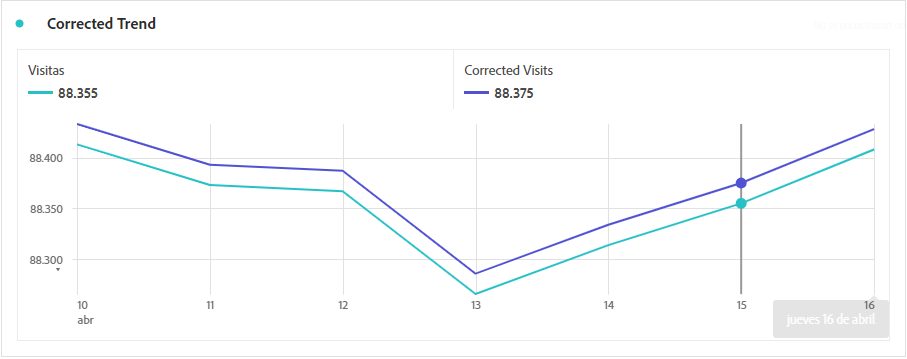

# Derivar datos afectados por eventos

Si tiene datos [afectados por un evento](overview.md), puede utilizar métricas calculadas para derivar valores estimados para la duración del evento. Por ejemplo, si tuvo un evento que provocó una caída de datos del 25 %, puede utilizarlo como multiplicador en una métrica calculada.

Estos pasos funcionan mejor cuando comprende el impacto de un evento, tanto desde la perspectiva de segmentación como de comparación de fechas. Asegúrese de seguir [Comparar fechas afectadas por un evento con intervalos anteriores](compare-dates.md) y [Excluir fechas específicas en el análisis](segments.md) antes de seguir esta página.

>[!NOTE]
>
>Este método es una estimación basada en un conjunto específico de entradas e intervalos de fechas. No será una solución completa para todos los casos de uso o fragmentos de datos. Además, este método requiere que el intervalo de fechas afectado tenga al menos 1 visita para calcular.

Para crear una métrica calculada estimada para el período de tiempo afectado:

1. Cree dos segmentos para &quot;Días afectados&quot; y &quot;Excluir días afectados&quot;, como se describe en [Excluir fechas específicas en el análisis](segments.md).
2. Vaya a **[!UICONTROL Componentes]** > **[!UICONTROL Métricas calculadas]**.
3. Haga clic en **[!UICONTROL Agregar]**.
4. Arrastre ambos segmentos anteriores al lienzo de definición. Cambie el operador entre ellos a `+` para sumarlos.
5. Añada la métrica deseada dentro de ambos segmentos. Por ejemplo, puede usar la métrica Visitas.

   

6. Haga clic en **[!UICONTROL Agregar]** en la parte superior derecha del contenedor &quot;Días afectados&quot; y, a continuación, haga clic en **[!UICONTROL Número estático]**. Establezca el número estático en el porcentaje con el que desea compensar los datos, como se describe en [Comparar fechas afectadas por un evento con intervalos anteriores](compare-dates.md). En este ejemplo, el desplazamiento es del 25 % o 1,25 %.

   

7. Aplique la métrica &quot;corregida&quot; en paralelo en una tabla de forma libre de tendencias. Todos los días fuera del evento reflejan su recuento de métricas normal, mientras que todos los días afectados utilizan el desplazamiento del multiplicador.

   

8. Vea los datos en una visualización de líneas para ver el efecto de la métrica corregida.

   
