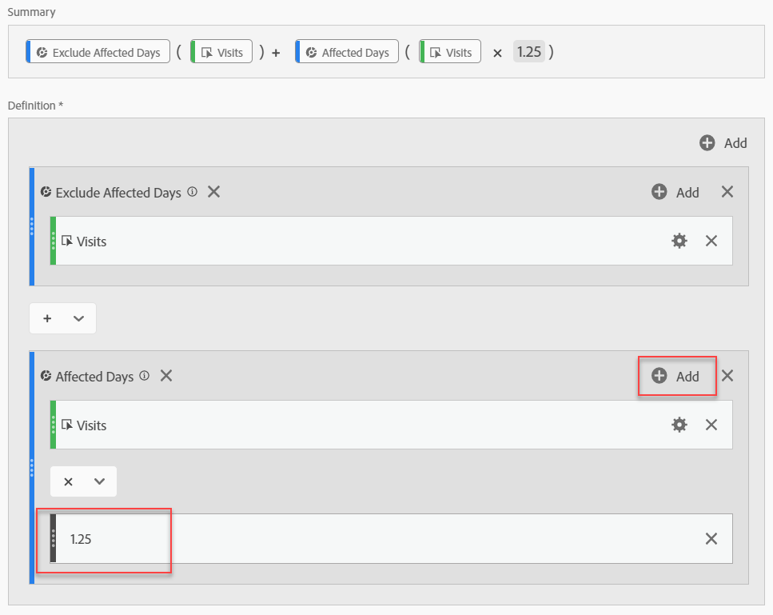

# Derivar datos afectados por eventos

Si tiene datos [afectados por un evento](overview.md), puede utilizar métricas calculadas para derivar valores estimados durante el evento. Por ejemplo, si tuvo un evento que causó una caída del 25 % en los datos, puede utilizarlo como multiplicador en una métrica calculada.

Estos pasos funcionan mejor cuando se comprende el impacto de un evento, tanto desde una perspectiva de segmentación como de comparación de fechas. Asegúrese de seguir [Comparar fechas afectadas por un evento con intervalos](compare-dates.md) anteriores y [Excluir fechas específicas en análisis](segments.md) antes de seguir esta página.

>[!NOTE]
>
>Este enfoque es una estimación basada en un conjunto específico de entradas e intervalos de fechas. No será una solución integral para todos los casos de uso o segmentos de datos. Además, este método requiere que el intervalo de fechas afectado tenga al menos 1 visita desde la que realizar el cálculo.

Para crear una métrica calculada estimada para el período de tiempo afectado:

1. Cree dos segmentos para &#39;Días afectados&#39; y &#39;Excluir días afectados&#39;, tal como se describe en [Excluir fechas específicas en la análisis](segments.md).
2. Vaya a **[!UICONTROL Componentes]** > Métricas **** calculadas.
3. Haga clic en **[!UICONTROL Agregar]**.
4. Arrastre los dos segmentos anteriores al lienzo de definición. Cambie el operador entre ellos a un `+` para sumarlos.
5. Añada la métrica deseada dentro de ambos segmentos. Por ejemplo, puede utilizar la métrica &quot;Visitas&quot;.

   

6. Haga clic en **[!UICONTROL Añadir]** en la parte superior derecha del contenedor &#39;Días afectados&#39; y, a continuación, haga clic en Número **** estático. Establezca el número estático en el porcentaje que desea desplazar los datos, como se describe en [Comparar fechas afectadas por un evento con intervalos](compare-dates.md)anteriores. En este ejemplo, el desplazamiento es 25 % o 1,25.

   

7. Aplique la métrica &quot;corregida&quot; de forma paralela en una tabla improvisada de tendencias. Todos los días fuera del evento reflejan su recuento de métricas normal, mientras que todos los días afectados utilizan el desplazamiento del multiplicador.

   

8. Vista los datos en una visualización de línea para ver el efecto de la métrica corregida.

   
