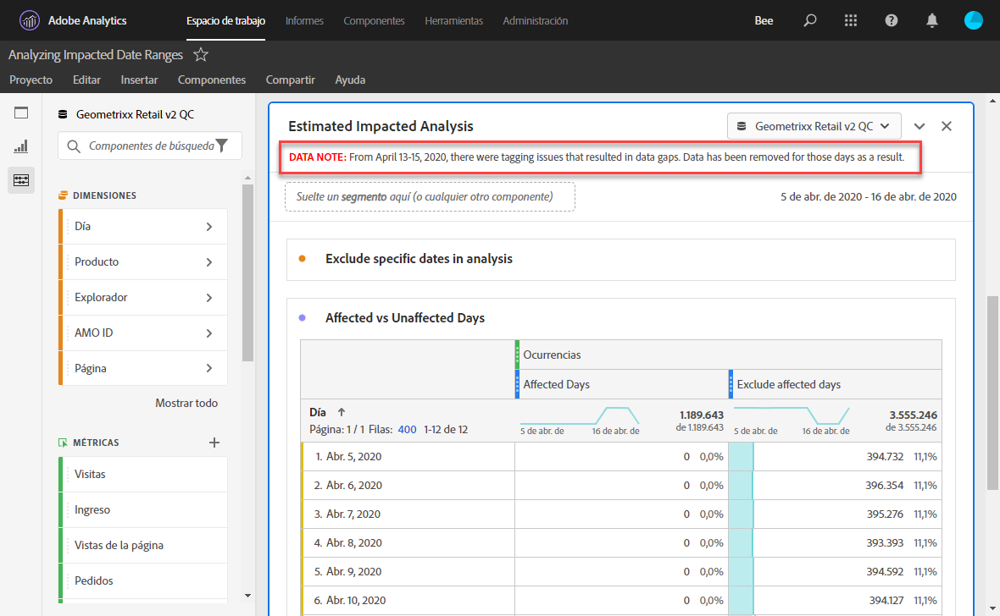
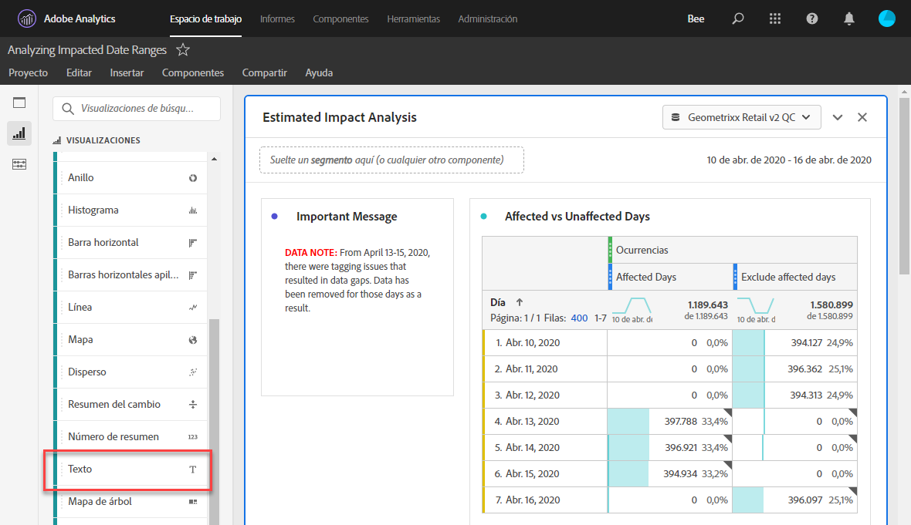
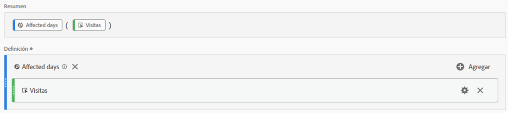
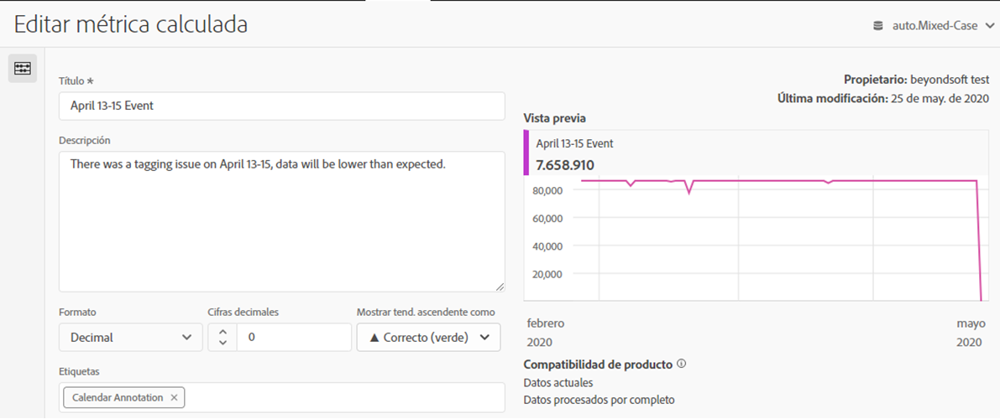
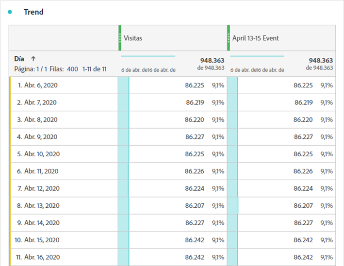
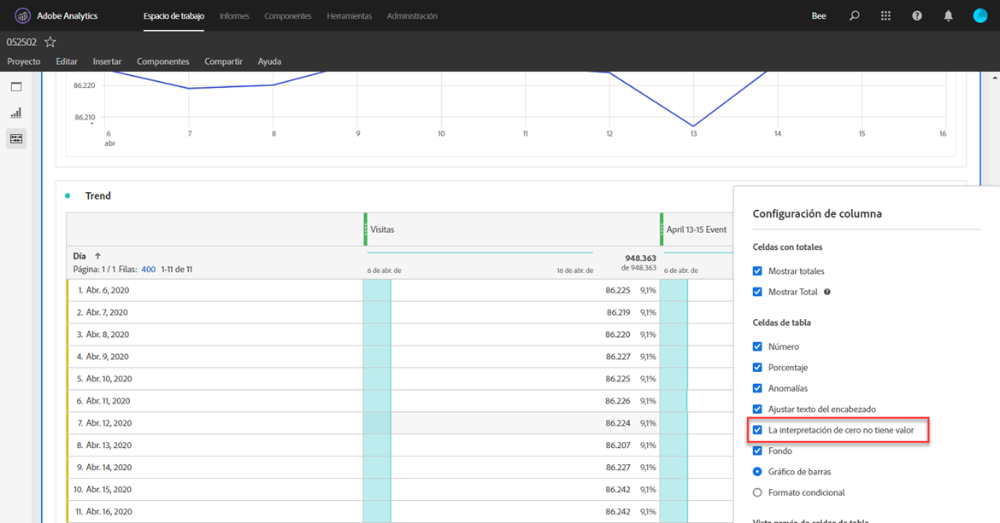
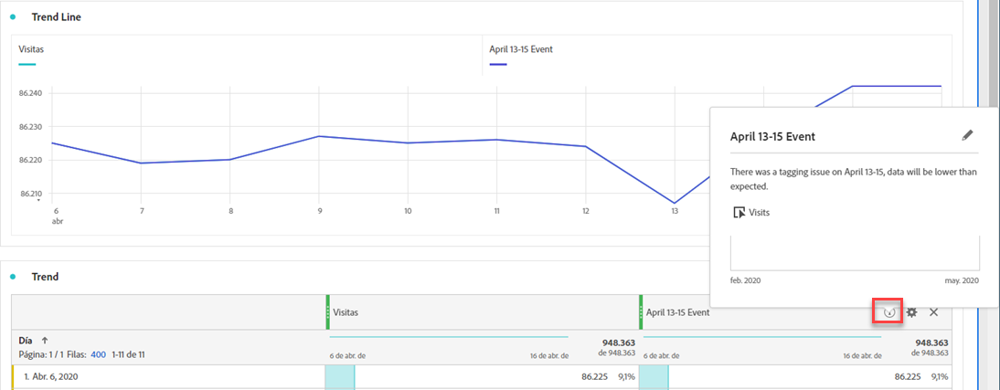
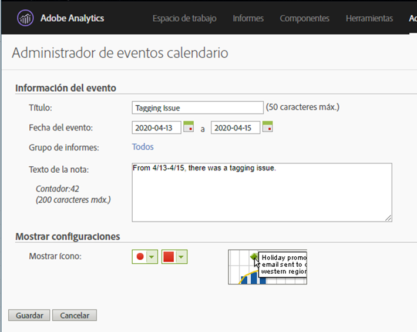

# Comunicar el impacto del evento a los usuarios

Si tiene datos [afectados por un evento](overview.md), es importante comunicar ese evento a los usuarios de su organización.

* Desarrolle una renuncia de responsabilidad común que pueda usar en las comunicaciones para mantener la coherencia
* Proporcionar comunicación continua a los usuarios de Analytics y a las partes interesadas clave durante y después del evento
* Coloque un recordatorio de calendario para hitos subsiguientes, como el mes o el año siguientes. En el futuro, esta comunicación ayudará a recordar a los usuarios que ven los informes el impacto que tendrán los informes mes tras mes o año tras año.

En Adobe Analytics, las secciones siguientes muestran diferentes formas de comunicarse con los usuarios de su organización. También puede utilizar otros métodos fuera de Adobe Analytics, como el correo electrónico, para comunicarse con los usuarios.

## Comunicarse mediante descripciones de paneles o visualizaciones

Si tiene un proyecto de Workspace compartido entre los usuarios de su organización, puede comunicar el impacto de un evento a través de descripciones de paneles o visualizaciones. Haga clic con el botón derecho en un panel o en el encabezado de visualización y, a continuación, seleccione **[!UICONTROL Editar descripción]**.

## Comunicarse mediante visualizaciones de texto

También puede comunicar el impacto de un evento mediante visualizaciones de texto dedicadas. Consulte [Visualizaciones de texto](/help/analyze/analysis-workspace/visualizations/text.md) en la guía de usuario sobre análisis.

## Añadir eventos de calendario personalizados a las tendencias de Workspace

Para cualquier visualización de tendencias en Workspace, puede agregar una serie que represente el intervalo de fechas afectado.

1. Cree una métrica calculada con el segmento &quot;Días afectados&quot; siguiendo [Excluir fechas específicas en analysis](segments.md).
1. Agregue la métrica deseada al lienzo de métricas calculadas.

   

1. Añada un título y una descripción para informar a los usuarios del impacto. También puede etiquetar esta métrica como anotación de calendario si lo desea.

   

1. En una tabla improvisada, añada la dimensión &quot;Día&quot;. Agregue &quot;Visitas&quot; y su métrica calculada como columnas en paralelo.

   

1. Haga clic en el icono de engranaje de configuración de columna para la métrica calculada y habilite **[!UICONTROL Interpretar cero como sin valor]**.

   

1. Agregue una visualización de Línea . Los días afectados se representan con un color diferente. Los usuarios también pueden hacer clic en el icono &quot;Información&quot; de la métrica calculada para obtener más información.

   

## Uso de un evento de calendario en Reports &amp; Analytics

Si utiliza Reports &amp; Analytics, puede utilizar un [evento de calendario](/help/components/t-calendar-event.md) para resaltar los días afectados en cualquier informe de tendencias. Este método no se aplica a Analysis Workspace.

1. Vaya a **[!UICONTROL Componentes]** > **[!UICONTROL Todos los componentes]** > **[!UICONTROL Eventos de calendario]**.
2. Introduzca el título, el intervalo de fechas y el texto de la nota que desee.
3. Haga clic en **[!UICONTROL Guardar]**.

