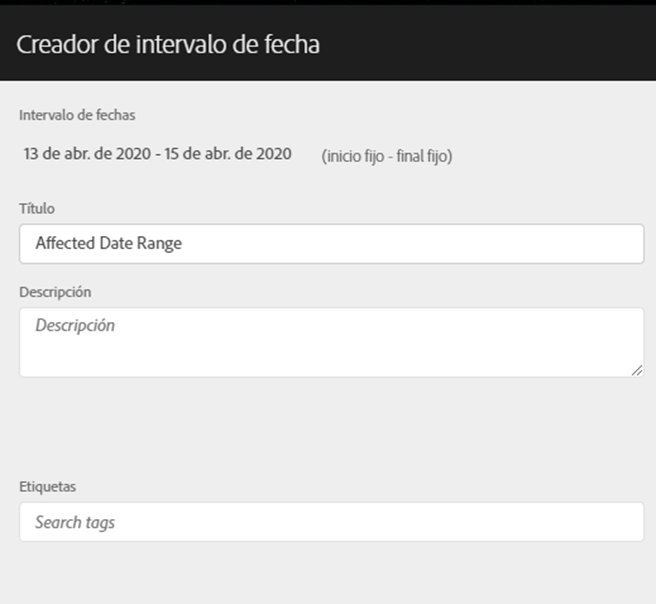
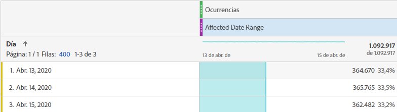
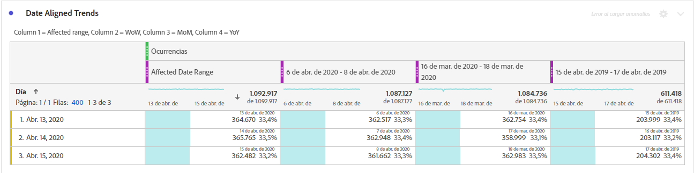
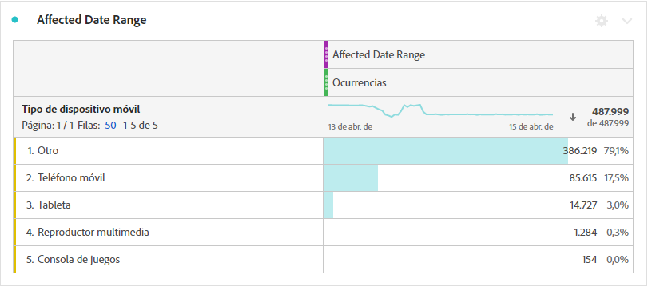
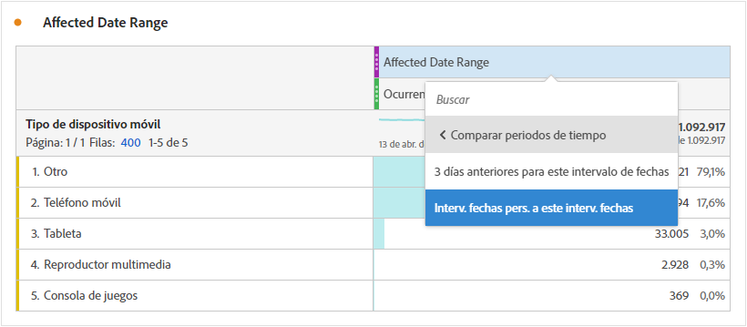
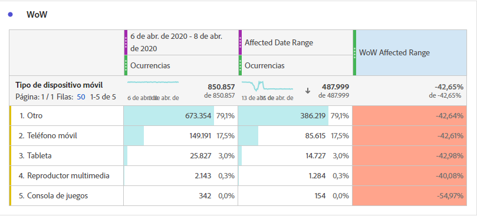
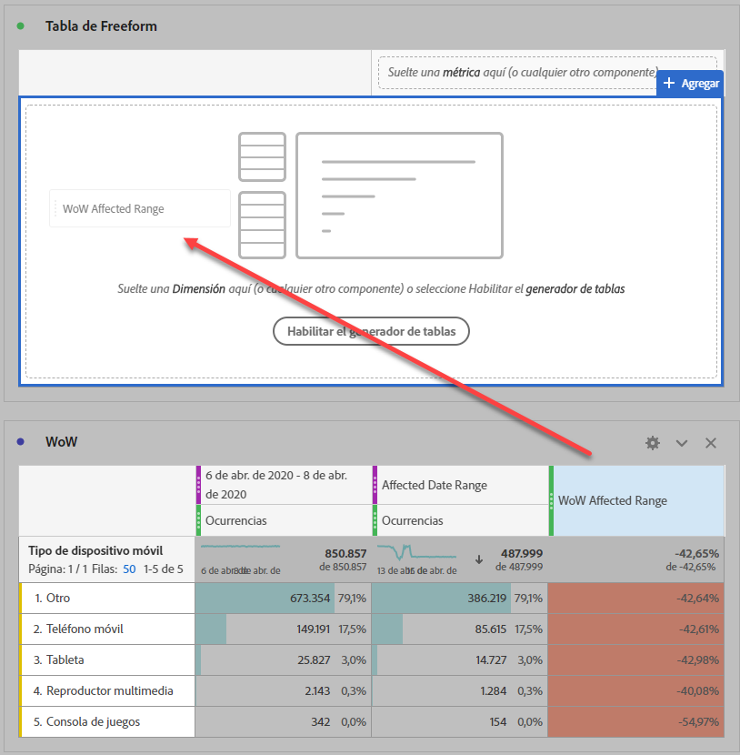
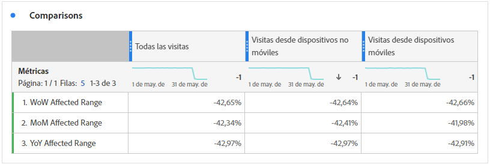

# Comparar fechas afectadas por un evento con intervalos anteriores

Si tiene datos [afectados por un evento](overview.md), puede observar las tendencias históricas para medir su impacto. Esta comparación es valiosa para comprender en qué medida un evento afecta a los datos, de modo que puede decidir si desea excluir los datos, agregar una nota a los informes o ignorarla.

## Crear un intervalo de fechas que incluya el evento

Cree un intervalo de fechas que abarque el evento para empezar a explorar el impacto de ese evento.

1. Vaya a **[!UICONTROL Componentes]** > Intervalos **** de fechas.
2. Haga clic en **[!UICONTROL Agregar]**.
3. Seleccione el intervalo de fechas en el que se produjo el evento. Haga clic en **[!UICONTROL Guardar]**.

   

## Fechas de evento de Vista e intervalos anteriores similares en paralelo

Puede comparar cualquier métrica entre el intervalo de fechas del evento con intervalos de fechas anteriores similares mediante una visualización de tabla improvisada.

1. Abra un proyecto de Workspace y agregue la dimensión &quot;Día&quot; a la tabla improvisada. Aplique el intervalo de fechas creado recientemente apilado en una métrica, como &quot;Ocurrencias&quot;.

   

2. Haga clic con el botón secundario en el intervalo de fechas y, a continuación, haga clic en **[!UICONTROL Añadir la columna]** del período de tiempo > Intervalo de fechas **[!UICONTROL personalizado a este intervalo]** de fechas.
   * Para una comparación semana tras semana, seleccione el intervalo del evento menos 7 días. Asegúrese de que los días de la semana entre el evento y este intervalo de fechas están alineados.
   * Para realizar una comparación mes tras mes, seleccione el intervalo del evento del mes pasado. También puede seleccionar el intervalo del evento menos 28 días si desea alinear los días de la semana.
   * Para una comparación año tras año, seleccione el rango del evento del año pasado.
3. Cuando selecciona el intervalo de fechas deseado, se agregan a la tabla improvisada. Puede hacer clic con el botón secundario y agregar tantos intervalos de fechas como desee comparar.

   

## Calcular las diferencias porcentuales entre el evento y rangos anteriores similares

Compare elementos de dimensión entre el intervalo de fechas de un evento y intervalos de fechas anteriores similares mediante una visualización de tabla improvisada. Estos pasos ilustran un ejemplo semanal que puede seguir.

1. Abra un proyecto de Workspace y agregue una dimensión **que** no sea de tiempo a la tabla improvisada. Por ejemplo, puede utilizar la dimensión &#39;Tipo de dispositivo móvil&#39;. Aplique el intervalo de fechas creado recientemente apilado en una métrica, como &quot;Ocurrencias&quot;:

   

2. Haga clic con el botón secundario en el intervalo de fechas y, a continuación, haga clic en **[!UICONTROL Comparar períodos]** de tiempo > Intervalo de fechas **[!UICONTROL personalizado con este intervalo]** de fechas. Seleccione el intervalo del evento menos 7 días. Asegúrese de que los días de la semana entre el evento y este intervalo de fechas están alineados.

   

3. Cambie el nombre de la métrica resultante &quot;Cambio porcentual&quot; por otra más específica, como &quot;Intervalo afectado de W&quot;. Haga clic en el icono de información y, a continuación, en el lápiz de edición para editar el nombre de la métrica.

   

4. Repita los pasos 3 y 4 para las comparaciones mes tras mes y año tras año. Puede realizar esta acción en la misma tabla o en tablas independientes.

## Analizar intervalos de fechas de comparación en forma paralela como filas

Si desea analizar más a fondo los cambios porcentuales anteriores, puede convertirlos en filas.

1. Añada una visualización de tabla improvisada y habilite el generador de tablas. Esta acción permite colocar las métricas de cambio porcentual en el orden deseado.
2. Mantenga pulsadas `Ctrl` (Windows) o `Cmd` (Mac) y arrastre las métricas de cambio del 3 por ciento a las filas de la tabla, de una en una.

   

3. Añada el segmento &#39;Todas las visitas&#39; a la columna de la tabla y a cualquier otro segmento que desee.

   

4. Haga clic en **[!UICONTROL Crear]**. En la tabla resultante, puede realizar la vista de los intervalos afectados en comparación con la semana, el mes y el año anteriores en todos los segmentos deseados.

   
