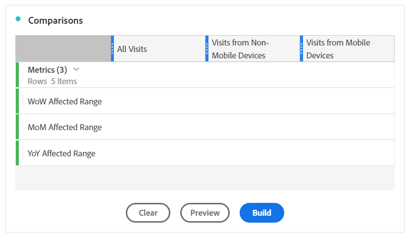

# Comparar fechas afectadas por un evento con intervalos anteriores

Si tiene datos [afectados por un evento](overview.md), puede observar las tendencias históricas para medir su impacto. Esta comparación es valiosa para comprender en qué medida un evento afecta a los datos, por lo que puede decidir si excluirlos, agregarles una nota o ignorarlos.

## Cree un intervalo de fechas que incluya el evento

Cree un intervalo de fechas que incluya el evento para empezar a explorar el impacto de ese evento.

1. Vaya a **[!UICONTROL Componentes]** > **[!UICONTROL Intervalos de fechas]**.
2. Haga clic en **[!UICONTROL Agregar]**.
3. Seleccione el intervalo de fechas en el que se produjo el evento. Haga clic en **[!UICONTROL Guardar]**.

   

## Ver en paralelo las fechas de los eventos y los intervalos anteriores similares

Puede comparar cualquier métrica entre el intervalo de fechas del evento con intervalos de fechas anteriores similares mediante una visualización de tabla de forma libre.

1. Abra un proyecto de Workspace y agregue la dimensión &quot;Día&quot; a la tabla de forma libre. Aplique el intervalo de fechas creado recientemente apilado en una métrica, como Ocurrencias.

   

2. Haga clic con el botón secundario en el intervalo de fechas y, a continuación, haga clic en **[!UICONTROL Agregar columna de período de tiempo]** > **[!UICONTROL Intervalo de fecha personalizado a este intervalo de fecha]**.
   * Para una comparación semana tras semana, seleccione el intervalo del evento menos 7 días. Asegúrese de que los días de la semana entre el evento y este intervalo de fechas estén alineados.
   * Para ver una comparación mes tras mes, seleccione el intervalo del evento del mes pasado. También puede seleccionar el intervalo del evento menos 28 días si desea alinear los días de la semana.
   * Para realizar una comparación año tras año, seleccione el intervalo del evento del año pasado.
3. Al seleccionar el intervalo de fechas deseado, se añaden a la tabla de forma libre. Puede hacer clic con el botón derecho y agregar tantos intervalos de fechas como desee comparar.

   

## Calcular las diferencias porcentuales entre el evento y los intervalos anteriores similares

Compare elementos de dimensión entre el intervalo de fechas de un evento y los intervalos de fechas anteriores similares mediante una visualización de tabla de forma libre. Estos pasos ilustran un ejemplo de una semana a otra que puede seguir.

1. Abra un proyecto de Workspace y agregue una **dimensión que no sea de tiempo** a la tabla de forma libre. Por ejemplo, puede utilizar la dimensión &quot;Tipo de dispositivo móvil&quot;. Aplique el intervalo de fechas creado recientemente apilado en una métrica, como &quot;Ocurrencias&quot;:

   

2. Haga clic con el botón secundario en el intervalo de fechas y, a continuación, haga clic en **[!UICONTROL Comparar períodos de tiempo]** > **[!UICONTROL Intervalo de fechas personalizado con este intervalo de fechas]**. Seleccione el intervalo del evento menos 7 días. Asegúrese de que los días de la semana entre el evento y este intervalo de fechas estén alineados.

   

3. Cambie el nombre de la métrica &quot;Cambio porcentual&quot; resultante por otro más específico, como &quot;Rango afectado por WoW&quot;. Haga clic en el icono de información y, a continuación, haga clic en el lápiz de edición para editar el nombre de la métrica.

   

4. Repita los pasos 3 y 4 para las comparaciones mes tras mes y año tras año. Puede realizar esta acción en la misma tabla o en tablas independientes.

## Analizar intervalos de fechas de comparación en paralelo como filas

Si desea analizar más a fondo los cambios porcentuales anteriores, puede convertirlos en filas.

1. Agregue una visualización de tabla de forma libre y habilite el generador de tablas. Esta acción le permite colocar las métricas de cambio porcentual en el orden deseado.
2. Mantenga `Ctrl` (Windows) o `Cmd` (Mac) y arrastre las métricas de cambio del 3 por ciento a las filas de la tabla, de una en una.

   

3. Agregue el segmento &quot;Todas las visitas&quot; a la columna de la tabla y a cualquier otro segmento que desee.

   

4. Haga clic en **[!UICONTROL Generar]**. En la tabla resultante, puede ver los rangos afectados en comparación con la semana, el mes y el año anteriores en cualquier segmento deseado.

   
