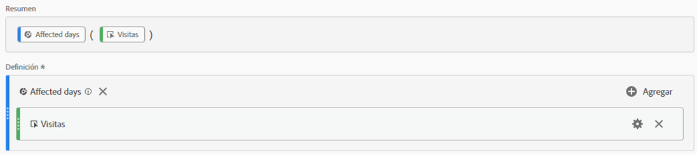
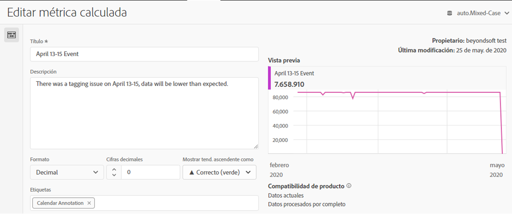
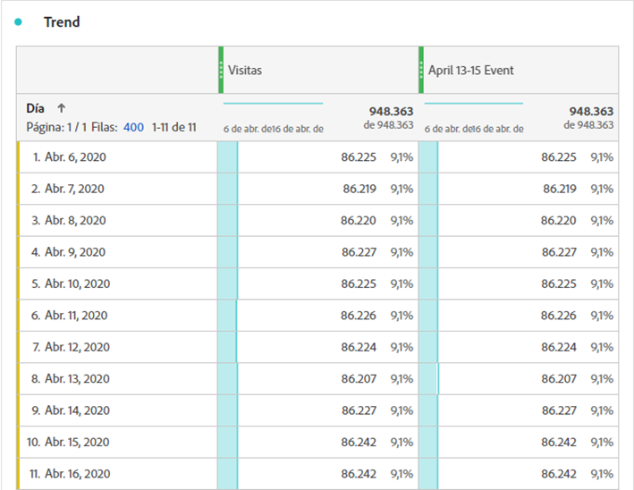
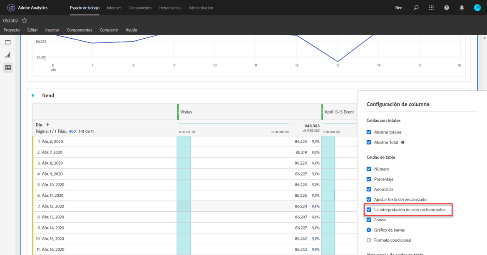
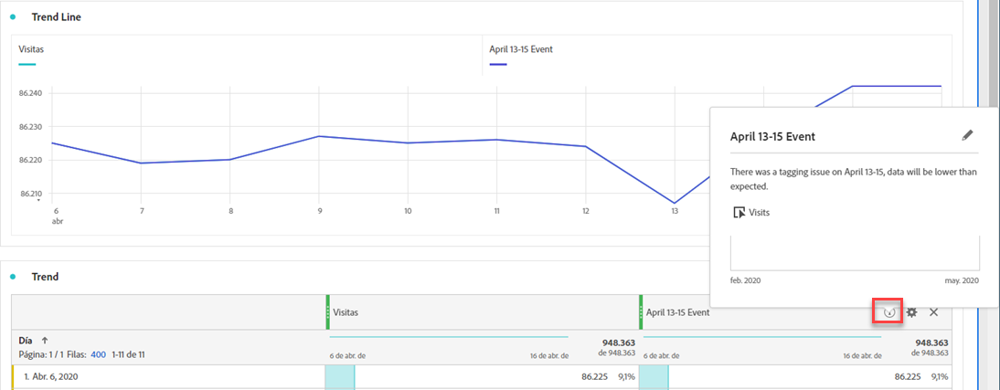
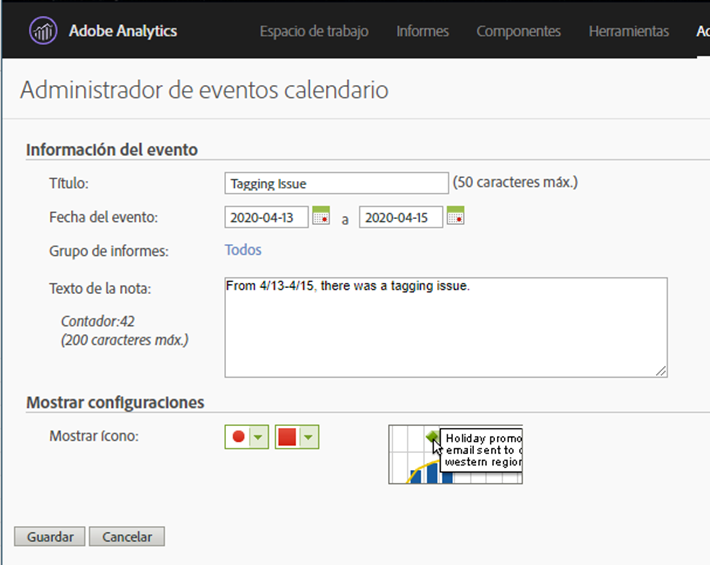

# Comunicar el impacto a los usuarios

Si tiene datos [afectados por un evento](../event-impacted.md), es importante comunicar ese evento a los usuarios de la organización.

* Desarrollar una renuncia de responsabilidad común que puede utilizar en las comunicaciones para mantener la coherencia
* Proporcionar comunicación continua a los usuarios de Analytics y a los principales interesados durante y después del evento
* Coloque un recordatorio de calendario para hitos posteriores, como el mes o el año siguiente. Esta comunicación en el futuro ayuda a recordar a los usuarios que ven los informes el impacto en los informes mes tras mes o año tras año.

En Adobe Analytics, las siguientes secciones muestran diferentes formas de comunicarse con los usuarios de su organización. También puede utilizar otros métodos fuera de Adobe Analytics, como el correo electrónico, para comunicarse con los usuarios.

## Comunicación mediante paneles o descripciones de visualización

Si tiene un proyecto de Workspace compartido entre usuarios de su organización, puede comunicar el impacto de un evento a través de paneles o descripciones de visualización. Haga clic con el botón derecho en un panel o en un encabezado de visualización y, a continuación, seleccione **[!UICONTROL Edit description]**.

## Comunicación mediante visualizaciones de texto

También puede comunicar el impacto de un evento mediante visualizaciones de texto dedicadas. See [Text visualizations](/help/analyze/analysis-workspace/visualizations/text.md) in the Analyze user guide.

## Añadir eventos de calendario personalizados a las tendencias en Workspace

Para cualquier visualización de tendencias en Workspace, puede agregar una serie que represente el intervalo de fechas afectado.

1. Cree una métrica calculada con el segmento &#39;Días afectados&#39; siguiendo [Excluir fechas específicas en la análisis](/help/components/c-segmentation/use-cases/exclude-date-range.md).
1. Añada la métrica deseada en el lienzo de la métrica calculada.

   

1. Añada un título y una descripción para informar a los usuarios del impacto. También puede etiquetar esta métrica como una anotación de calendario si lo desea.

   

1. En una tabla improvisada, agregue la dimensión &#39;Día&#39;. Añada &#39;Visitas&#39; y la métrica calculada como columnas en paralelo.

   

1. Haga clic en el icono de engranaje de configuración de columna para la métrica calculada y habilite **[!UICONTROL Interpret zero as no value]**.

   

1. Añada una visualización de línea. Los días afectados se representan con un color diferente. Los usuarios también pueden hacer clic en el icono &#39;Información&#39; de la métrica calculada para obtener más información.

   

## Usar un evento de calendario en Informes y análisis

Si utiliza Informes y análisis, puede utilizar un evento [de](/help/components/t-calendar-event.md) calendario para resaltar los días afectados en cualquier informe de tendencias. Este método no se aplica a Análisis Workspace.

1. Vaya a **[!UICONTROL Components]** > **[!UICONTROL Calendar events]**.
2. Introduzca el título, el intervalo de fechas y el texto de la nota que desee.
3. Haga clic en **[!UICONTROL Save]**.

