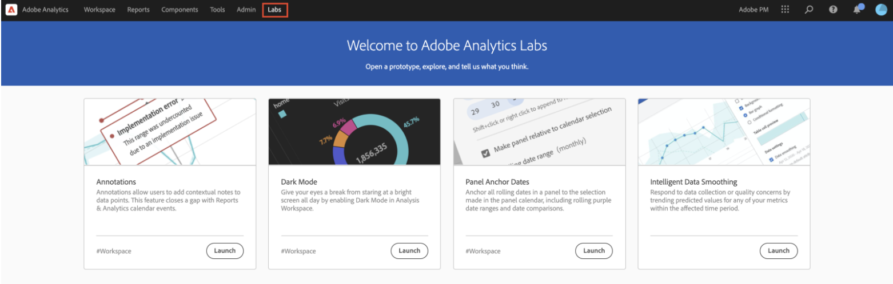
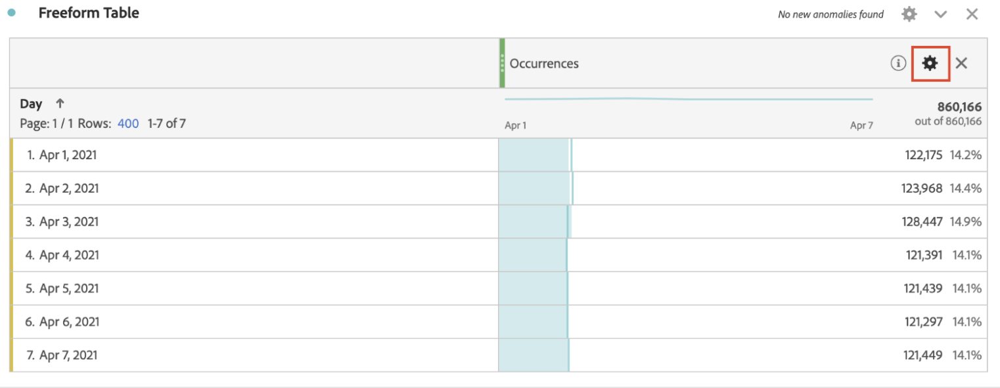
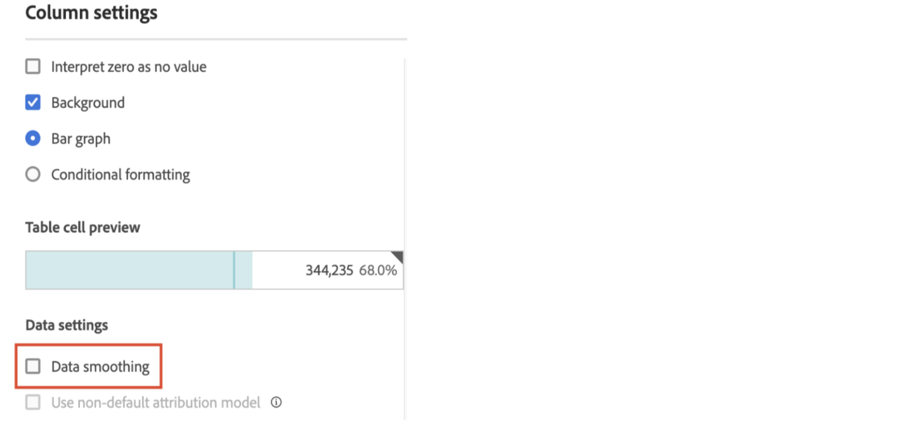

# Suavizado de datos inteligente

En raras ocasiones, algunos factores pueden afectar a la calidad de los datos. El tráfico de bots, los cambios de implementación o las interrupciones del servicio pueden afectar a la integridad de los datos recopilados. También complican el análisis sobre cómo el evento puede haber afectado a la integridad de los datos.

El suavizado de datos inteligente es un prototipo en [Analytics Labs](/help/analyze/labs.md) que puede ayudar a completar esta vista analizando las tendencias históricas para predecir el valor de cualquier métrica dentro del período de tiempo afectado. El prototipo aplica algoritmos avanzados de aprendizaje automático para trazar los valores esperados para las métricas a lo largo del período de tiempo que se analiza.

## Ejecutar suavizado de datos inteligente

1. Vaya a Adobe Analytics Labs:
   
1. Inicie el prototipo de suavizado de datos inteligente.
   
1. Agregue la métrica que debe analizarse a la tabla de forma libre. El prototipo solo funciona con una granularidad diaria, por lo que asegúrese de que la dimensión de la tabla sea Día.
   
1. Elija un intervalo de fechas que sea más ancho que la ventana del evento, pero asegúrese de que incluye el evento.
   
1. Haga clic en el icono de engranaje de la métrica en la tabla de forma libre.
   
1. En [!UICONTROL Configuración de datos], seleccione la opción [!UICONTROL Suavizado de datos].
   
1. Seleccione el intervalo de fecha/fecha correspondiente al evento y haga clic en [!UICONTROL Aplicar].
Asegúrese de que el intervalo de datos para el suavizado de datos sea un subconjunto del intervalo de fechas seleccionado para el panel. Las métricas de la tabla y el gráfico se sustituyen por los valores predichos.
   
