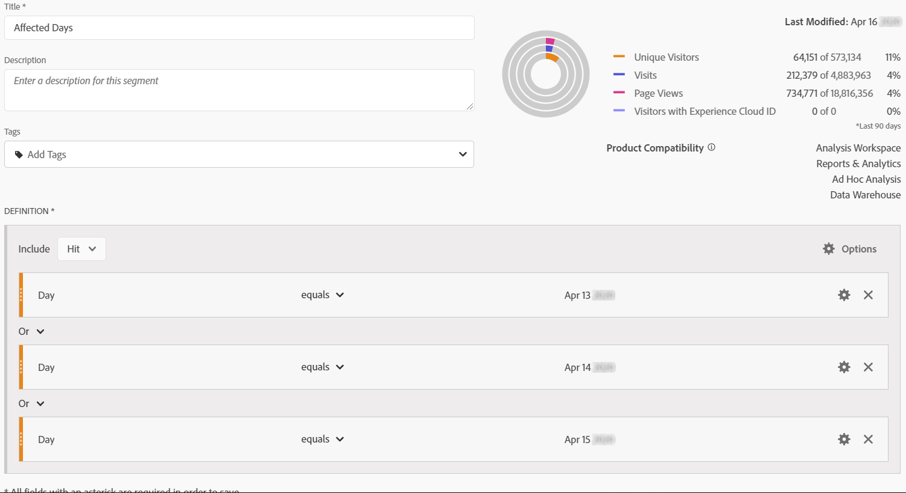
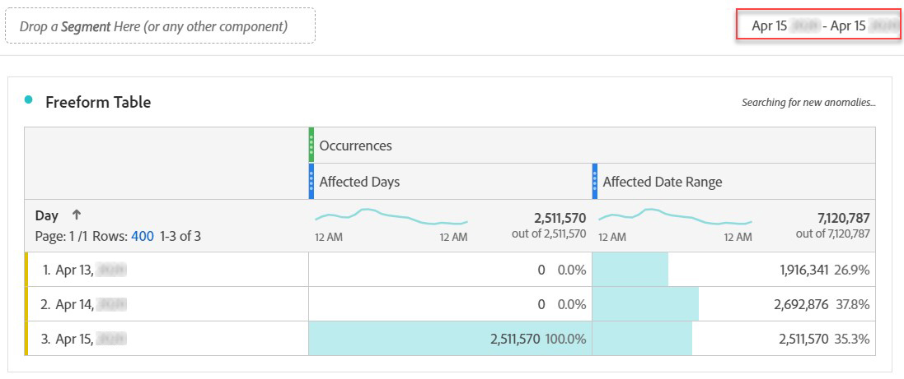

# Excluir fechas específicas en el análisis

Si tiene datos [afectados por un evento](overview.md), puede usar un segmento para excluir cualquier intervalo de fechas que no desee incluir en los informes. La segmentación de fechas afectadas por eventos puede ayudar a evitar que su organización tome decisiones sobre los datos parciales.

## Aislar días afectados {#isolate}

Cree un segmento que aísle el día o el intervalo de fechas afectado. Este segmento es útil si desea centrarse únicamente en los días problemáticos para ver más información sobre su impacto.

1. Abra el generador de segmentos en **[!UICONTROL Componentes]** > **[!UICONTROL Segmentos]** y, a continuación, haga clic en **[!UICONTROL Agregar]**.
2. Arrastre la dimensión &quot;Día&quot; al lienzo de definición y configúrelo igual al día que desee aislar.
3. Repita el paso anterior todos los días que desee aislar en el informe.

>[!TIP]
>
>Para cambiar la instrucción OR a una instrucción AND, haga clic en la flecha hacia abajo situada junto a OR y seleccione AND.

Adobe recomienda utilizar los componentes de dimensión naranjas y no los componentes morados del intervalo de fechas. Si utiliza componentes de intervalo de fecha morados, anulan el intervalo de calendario del proyecto:

## Excluir días afectados {#exclude}

Cree un segmento que excluya el día o el intervalo de fechas afectado. Este segmento es útil si desea excluir los días en los que se produjeron problemas para minimizar el impacto en la creación de informes generales.

1. Abra el generador de segmentos en **[!UICONTROL Componentes]** > **[!UICONTROL Segmentos]** y, a continuación, haga clic en **[!UICONTROL Agregar]**.
2. En la parte superior derecha del lienzo de definición del segmento, haga clic en **[!UICONTROL Opciones]** > **[!UICONTROL Excluir]**.
3. Arrastre la dimensión &quot;Día&quot; al lienzo de definición y configúrelo igual al día que desee eliminar.
4. Repita el paso anterior todos los días que desee eliminar en el informe.

## Uso de estos segmentos en los informes

Una vez creado el segmento de exclusión, puede utilizarlo exactamente como lo haría con otros segmentos.

### Comparar segmentos en un informe de tendencias {#compare}

Puede aplicar los segmentos &quot;Días afectados&quot; y &quot;Excluir días afectados&quot; en un informe para compararlos en paralelo. Arrastre ambos segmentos por encima o por debajo de una métrica para compararlos:

Si no desea mostrar ceros en la tabla o en las visualizaciones (lo que provoca caídas), habilite **[!UICONTROL Interpretar cero como sin valor]** en la configuración de columna.

Si no desea mostrar ceros en la tabla o en las visualizaciones (lo que provoca caídas), habilite **[!UICONTROL Interpretar cero como sin valor]** en la configuración de columna.

### Aplicación del segmento de exclusión a un proyecto {#apply}

Puede aplicar el segmento Excluir días afectados a un proyecto de Workspace. Arrastre el segmento de exclusión a la sección del lienzo de Workspace con la etiqueta *Colocar un segmento aquí*.

>[!TIP]
>
>Incluya una nota sobre los datos excluidos en la descripción del panel para ayudar a los que ven el informe. Haga clic con el botón secundario en el título de un panel y, a continuación, haga clic en **[!UICONTROL Editar descripción]**.

### Uso del segmento de exclusión en un grupo de informes virtuales {#use-vrs}

Puede usar el segmento en un [grupo de informes virtuales](/help/components/vrs/vrs-about.md) para excluir los datos de manera más práctica. Esta opción es ideal porque no tiene que recordar aplicar el segmento para cada informe que incluya el intervalo de fechas afectado. Si ya utiliza los grupos de informes virtuales como fuente principal de datos, puede agregar el segmento a un grupo de informes virtuales existente.

1. Vaya a **[!UICONTROL Componentes]** > **[!UICONTROL Grupos de informes virtuales]**.
2. Haga clic en **[!UICONTROL Agregar]**.
3. Introduzca el nombre y la descripción que desee para el grupo de informes virtuales.
4. Arrastre el segmento de exclusión al área denominada **[!UICONTROL Agregar segmento]**.
5. Haga clic en **[!UICONTROL Continuar]** en la esquina superior derecha y, a continuación, haga clic en **[!UICONTROL Guardar]**.

