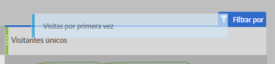

# Guía de traducción de métricas comúnmente empleadas en otras plataformas

En otras plataformas, como Google Analytics, muchos informes tienen el mismo número de métricas. Utilice esta página de instrucciones para reproducir las métricas que se emplean en muchos informes.

Para añadir varias métricas a una tabla de forma libre en el espacio de trabajo, arrastre la métrica desde el área de componentes y colóquela junto al encabezado de la métrica:

## Métricas de adquisición

Los **Usuarios** son aproximadamente iguales a los **Visitantes únicos** en Workspace. Consulte la métrica [Visitantes únicos](/help/components/metrics/unique-visitors.md) en la guía del usuario de Componentes para obtener más información.

Los **Nuevos usuarios** se pueden obtener de la siguiente manera:

1. Arrastre la métrica **Visitantes únicos** al espacio de trabajo.
2. Arrastre el segmento **Visitas por primera vez** por encima de los encabezados de métrica Visitantes únicos:

   

Las **Sesiones** son aproximadamente iguales a las **Visitas** en Analysis Workspace. Consulte la métrica [Visitas](/help/components/metrics/visits.md) en la guía del usuario Componentes para obtener más información.

## Métricas de comportamiento

La **Tasa de devoluciones** se puede utilizar fácilmente como métrica en Analysis Workspace. Consulte la métrica [Tasa de devoluciones](/help/components/metrics/bounce-rate.md) en la guía del usuario de componentes para obtener más información.

**Páginas/sesión** es una métrica calculada. Puede obtenerse de la siguiente manera:

1. Si ya ha creado esta métrica calculada, localícela en Métricas y arrástrela al espacio de trabajo.
2. Si aún no ha creado esta métrica calculada, haga clic en el icono **+** situado junto a la lista de métricas para abrir el Creador de métricas calculadas.
3. Asigne un título “Vistas de página por visita” y una descripción, opcionalmente.
4. Establezca el formato Decimal y dos decimales.
5. Arrastre la métrica **Vistas de página** y la métrica **Visitas** al área de definición.
6. Organice la definición para que la fórmula sea **Vistas de página divididas por Visitas**.

   

7. Haga clic en Guardar para volver al espacio de trabajo.
8. Arrastre la métrica calculada recién definida al espacio de trabajo.

   Obtenga más información sobre las [métricas calculadas](/help/components/c-calcmetrics/cm-overview.md) en la Guía del usuario de componentes.

El **Promedio de duración de la sesión** es aproximadamente igual al **Tiempo empleado por visita (segundos)**. En la Guía del usuario de componentes, hay más información acerca de las métricas de [Tiempo empleado por visita](/help/components/metrics/time-spent-per-visit.md).

## Métricas de conversión

La **Tasa de conversión de objetivos**, las **Consecuciones de objetivos** y el **Valor de los objetivos** necesitan una implementación adicional en ambas plataformas. Si su implementación ya incorpora la dimensión de productos y el evento de compra, siga estos pasos:

1. Arrastre las métricas **Pedidos**, **Ingresos** y **Visitas** al espacio de trabajo.
1. Cree una métrica calculada de **Pedidos por visita**. Pulse Ctrl+clic (Windows) o Cmd+clic (Mac) en ambos encabezados de métrica para resaltarlos. Haga clic con el botón derecho en uno de los encabezados, seleccione **Crear métrica a partir de la selección** y, a continuación, haga clic en **Dividir**. Esta nueva métrica es similar a una Tasa de conversión de objetivos.
1. Si se necesitan decimales, edite la Métrica calculada. Haga clic en el botón Información en el encabezado de la métrica y, a continuación, en el icono del lápiz. Agregue uno o dos decimales en la ventana Generador de métricas calculadas y haga clic en Guardar.

   

Si su implementación aún no admite datos de conversión o producto, Adobe recomienda trabajar con un asesor de implementación para garantizar la calidad y la integridad de los datos.
