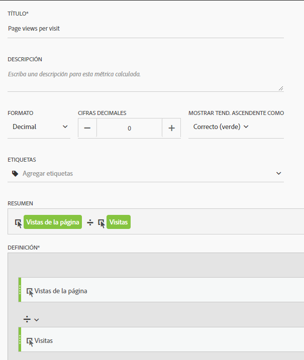
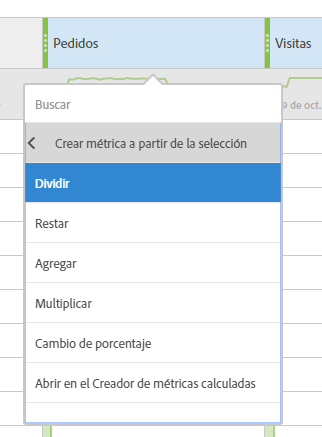

# Métricas utilizadas comúnmente en otras plataformas de traducción de plataformas

En otras plataformas, como Google Analytics, muchos informes comparten un número común de métricas. Utilice esta página para comprender cómo recrear las métricas utilizadas en muchos informes.

Para agregar varias métricas a una tabla improvisada de espacio de trabajo, arrastre la métrica desde el área de componentes al lado del encabezado de métrica en el espacio de trabajo:

## Métricas de adquisición

**Los usuarios** equivalen aproximadamente a los visitantes **únicos** en Workspace. See the [Unique Visitors](../../../components/c-variables/c-metrics/metrics-unique-visitors.md) metric in the Components user guide for additional details.

**Los nuevos usuarios** se pueden obtener mediante lo siguiente:

1. Drag the **Unique Visitors** metric onto the workspace.
2. Drag the **First Time Visits** segment above the Unique Visitors metric headers:

   

**Las sesiones** equivalen aproximadamente a **Visitas** en Analysis Workspace. See the [Visits](../../../components/c-variables/c-metrics/metrics-visit.md) metric in the Components user guide for additional details.

## Métricas de comportamiento

**La tasa** de devoluciones está disponible en Analysis Workspace como métrica. See the [Bounce Rate](../../../components/c-variables/c-metrics/metrics-bounce-rate.md) metric in the Components user guide for additional information.

**Páginas/Sesión** es una métrica calculada. Se puede obtener mediante lo siguiente:

1. Si ya ha creado esta métrica calculada, localícela en Métricas y arrástrela al espacio de trabajo.
2. If you have not yet created this calculated metric, click the **+** icon near the metric list to open the Calculated Metric Builder.
3. Déle un título de'Vistas de página por visita'y una descripción si lo desea.
4. Establezca el formato en Decimal y defina el número de decimales en 2.
5. Drag the **Page views** metric and **Visits** metric into the definition area.
6. Arrange the definition so the formula is **Page Views divided by Visits**.

   

7. Haga clic en Guardar para volver al espacio de trabajo.
8. Arrastre la métrica calculada recientemente definida al espacio de trabajo.

   Learn more about [Calculated Metrics](../../../components/c-variables/c-metrics/calculated-metric.md) in the Components user guide.

**Tiempo Session Duration** is approximately equal to **Time Spent per Visit (seconds)**. Learn more about [Time Spent](../../../components/c-variables/c-metrics/metrics-time-spent.md) metrics in the Components user guide.

## Métricas de conversiones

**La tasa de conversión de objetivos**, **las finalizaciones** de objetivos y **el valor** objetivo requieren una implementación adicional en ambas plataformas. Si la implementación ya tiene cabida en la dimensión de productos y en el evento purchase, considere los siguientes pasos:

1. Drag the **Orders** metric, **Revenue** metric, and **Visits** metric onto the workspace.
1. Create a calculated metric of **Orders per Visit**. Utilice ctrl + clic (Windows) o cmd + clic (Mac) en ambos encabezados de métrica para resaltarlos. Right-click one of the headers, select **Create Metric From Selection**, then click **Divide**. Esta nueva métrica es similar a la tasa de conversión de objetivos.
1. Si es necesario decimales, edite la métrica calculada. Haga clic en el botón Información en el encabezado de métrica y, a continuación, en el icono de lápiz. Agregue 1 o 2 Cifras decimales en la ventana Creador de métricas calculadas y, a continuación, haga clic en Guardar.

   

Si la implementación aún no se ajusta a los datos de productos o conversión, Adobe recomienda trabajar con un consultor de implementación para garantizar la integridad y la integridad de los datos.
