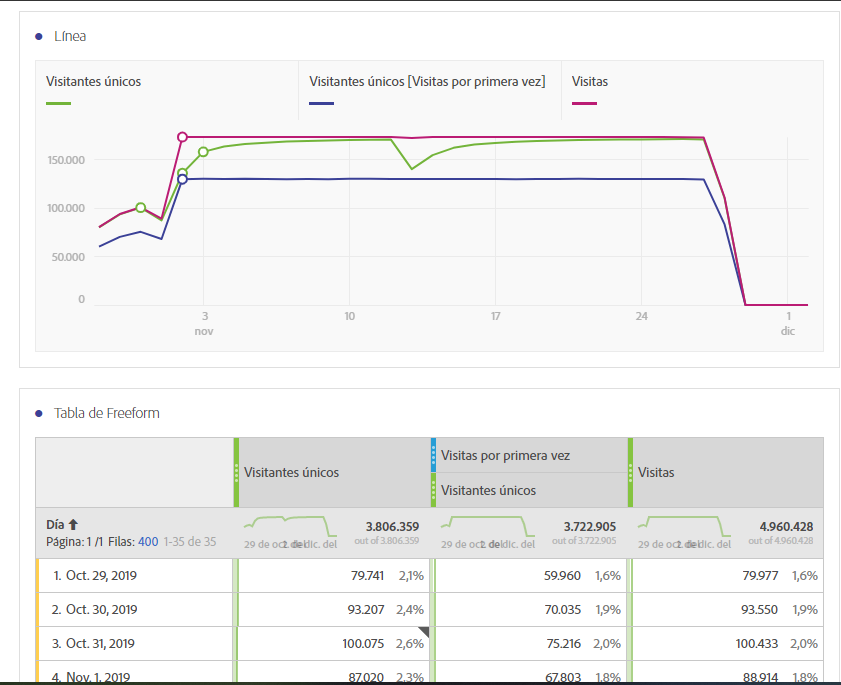

# Métricas comúnmente utilizadas en la guía de traducción de otras plataformas

En otras plataformas, como Google Analytics, muchos informes comparten un número común de métricas. Utilice esta página para comprender cómo volver a crear las métricas utilizadas en muchos informes.

Para agregar varias métricas a una tabla improvisada del área de trabajo, arrastre la métrica desde el área de componentes junto al encabezado de la métrica en el área de trabajo:

## Métricas de adquisición

**Los usuarios** son aproximadamente iguales a los visitantes **** únicos en Workspace. Consulte la métrica Visitantes  únicos en la guía del usuario Componentes para obtener más información.

**Los nuevos usuarios** se pueden obtener de la siguiente manera:

1. Arrastre la métrica Visitantes **** únicos al área de trabajo.
2. Arrastre el segmento **Visitas** por primera vez por encima de los encabezados de métrica Visitantes únicos:

   

**Las sesiones** son aproximadamente iguales a **las visitas** en Analysis Workspace. Consulte la métrica [Visitas](/help/components/c-variables/c-metrics/metrics-visit.md) en la guía del usuario Componentes para obtener más detalles.

## Métricas de comportamiento

**La tasa** de devoluciones está disponible en Analysis Workspace como métrica. Consulte la métrica [Tasa](/help/components/c-variables/c-metrics/metrics-bounce-rate.md) de devoluciones en la guía del usuario Componentes para obtener información adicional.

**Páginas/Sesión** es una métrica calculada. Puede obtenerse mediante:

1. Si ya ha creado esta métrica calculada, localícela en Métricas y arrástrela al área de trabajo.
2. Si aún no ha creado esta métrica calculada, haga clic en el icono **+** situado junto a la lista de métricas para abrir el Creador de métricas calculadas.
3. Asigne un título a 'Vistas de página por visita' y una descripción si lo desea.
4. Establezca el formato en Decimal y establezca el número de decimales en 2.
5. Arrastre la métrica Vistas **de** página y la métrica **Visitas** al área de definición.
6. Organice la definición para que la fórmula sea Vistas de **página divididas por Visitas**.

   

7. Haga clic en Guardar para volver al espacio de trabajo.
8. Arrastre la métrica calculada recién definida al espacio de trabajo.

   Obtenga más información sobre las métricas [calculadas](/help/components/c-variables/c-metrics/calculated-metric.md) en la guía del usuario Componentes.

**Tiempo La duración** de la sesión es aproximadamente igual al **tiempo empleado por visita (segundos)**. Obtenga más información sobre las métricas de [tiempo empleado](/help/components/c-variables/c-metrics/metrics-time-spent.md) en la guía del usuario Componentes.

## Métricas de conversión

**La tasa** de conversión de objetivos, las finalizaciones **de** objetivos y el valor **de los** objetivos requieren una implementación adicional en ambas plataformas. Si su implementación ya acomoda la dimensión de productos y el evento de compra, considere los siguientes pasos:

1. Arrastre la métrica **Pedidos** , **Ingresos** y **Visitas** al área de trabajo.
1. Cree una métrica calculada de **pedidos por visita**. Use ctrl+clic (Windows) o cmd+clic (Mac) en ambos encabezados de métrica para resaltarlos. Haga clic con el botón derecho en uno de los encabezados, seleccione **Crear métrica a partir de selección** y, a continuación, haga clic en **Dividir**. Esta nueva métrica es similar a una tasa de conversión de objetivo.
1. Si se necesitan lugares decimales, edite la métrica calculada. Haga clic en el botón Información en el encabezado de la métrica y, a continuación, en el icono del lápiz. Agregue 1 o 2 lugares decimales en la ventana Creador de métricas calculadas y haga clic en Guardar.

   

Si su implementación aún no admite datos de conversión o producto, Adobe recomienda trabajar con un asesor de implementación para garantizar la calidad y la integridad de los datos.
