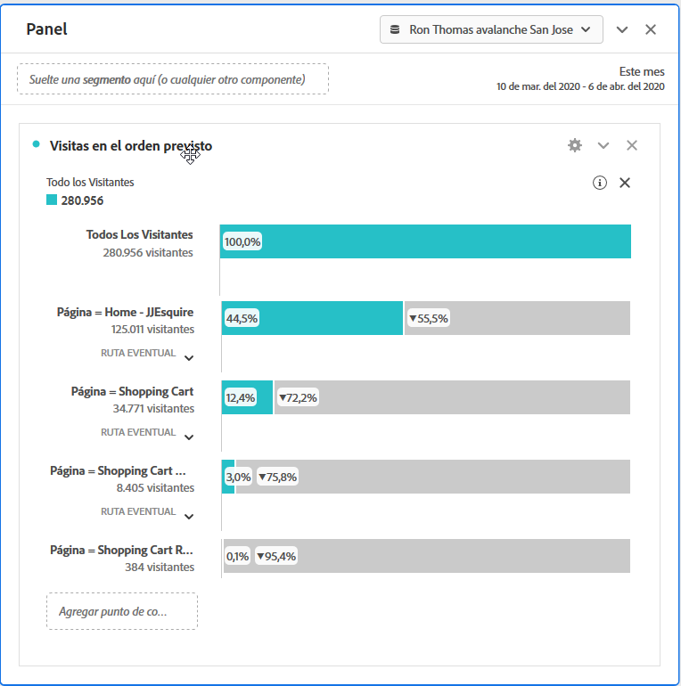
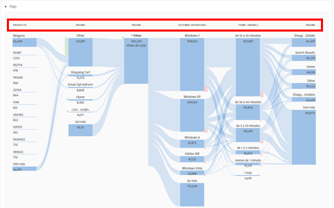

# Informes Conversiones

Una «conversión» es una acción que realiza un visitante en su sitio que se traduce directamente en los indicadores clave de su organización. Los informes de conversiones muestran los detalles sobre cómo se convierten los visitantes.

En esta página se asume que el usuario tiene conocimientos básicos sobre el uso de Analysis Workspace. See [Create a basic report in Analysis Workspace for Google Analytics users](create-report.md) if you are not yet familiar with the tool in Adobe Analytics.

## Informes de objetivos

Los objetivos proporcionan a los usuarios de Google Analytics una forma de definir la conversión de un sitio web. Son la manera predeterminada de crear canales, flujos de comportamiento inverso, canales multicanal y atribución. Los objetivos de Google Analytics no son retroactivos y solo se pueden configurar en la página de administración. Además, se basan en una página, evento, tiempo empleado o número promedio de páginas.

En Adobe Analytics, el concepto de objetivo no es necesario porque las métricas pueden aplicarse en cualquier contexto. Siempre y cuando la implementación satisfaga los eventos que desee rastrear, puede ajustar cualquier informe de conversión e inmediatamente obtener los resultados de los datos históricos.

### Visualización de canal

El informe de visualización de canal ayuda a los analistas a centrarse en una serie concreta de pasos necesarios para convertir. Por ejemplo: antes de realizar una compra, un visitante de un sitio de comercio electrónico tendría que acceder al carro de compras, a la página de facturación y envío, a la página de pago y a la página de revisión de pedidos.

En Analysis Workspace, estos datos se pueden ver usando la visualización de Visitas en el orden previsto.

1. Haga clic en el icono de visualizaciones a la izquierda y arrastre una visualización de visitas en el orden previsto al espacio de trabajo encima de la tabla improvisada.
2. Click the components icon on the left, then locate the **Pages** dimension.
3. Haga clic en el icono de flecha junto a la dimensión Páginas para revelar los valores de página. Los valores de dimensión se colorean en color amarillo.
4. Busque la página que desee para actuar como el primer punto de contacto y arrástrela al espacio rotulado&#39;Agregar Touchpoint&#39;en la visualización.
5. Siga añadiendo puntos de contacto que desee arrastrando los valores de página a la visualización.

La visualización de visitas en el orden previsto no está limitada únicamente a la dimensión Páginas. Cualquier dimensión, métrica o segmento puede utilizarse para adaptar el informe de visitas en el orden previsto a fin de satisfacer las necesidades de su organización.

## Informes de comercio electrónico

Los informes de comercio electrónico suelen ser utilizados por sitios que venden productos o servicios para medir pedidos e ingresos en artículos comprados. Esta función está disponible en Adobe Analytics y se denomina informes de productos.

Tanto los informes de comercio electrónico en Google Analytics como los informes de productos en Adobe Analytics requieren cambios de implementación personalizados. See the [Products](../../../components/c-variables/dimensionslist/reports-products.md) dimension in the Components user guide for more information.

## Informes de canales multicanal

Los informes de canal multicanal proporcionan datos de canal de mercadotecnia adicionales más allá de lo que proporcionan los informes de adquisición. Estos informes se centran en la conversión de los visitantes en lugar de en cómo llegan los visitantes al sitio.

> [!NOTE]
>
> El uso de informes multicanal en Adobe Analytics requiere la configuración de los canales de marketing y una implementación personalizada para dar cabida a la variable products y a los eventos de compra. Adobe recomienda trabajar con un asesor de implementación si estas funciones aún no están configuradas para su grupo de informes.

### Multicanal: conversiones asistidas

Las conversiones asistidas muestran cuántas veces cada canal contribuyó con una conversión. In Analysis Workspace, the **Order Assists** metric can be used.

1. In the Components menu, locate the **Marketing Channel** dimension and drag it onto the large freeform table area labeled &#39;Drop a Dimension here&#39;.
2. Drag the **Order Assists** metric on top of the automatically created **Occurrences** metric header to replace it. Si lo desea, se pueden arrastrar métricas adicionales al espacio de trabajo.

### Multicanal: rutas de conversión principales

El informe de rutas de conversión principales muestra las rutas de canal principales que toma un usuario antes de la conversión. Analysis Workspace usa un informe de flujo para visualizar las rutas de conversión principales.

1. Haga clic en el icono Paneles de la izquierda y arrastre un panel de Atribución encima de la tabla improvisada.
2. Click the Components icon on the left, locate the **Marketing Channel** dimension, and drag it to the box labeled &#39;Add Dimension&#39;.
3. Busque el evento de conversión deseado en Métricas (p. ej. Pedidos) y arrástrelo a la casilla rotulada&#39;Agregar métrica &#39;. Tenga en cuenta que las métricas calculadas no son compatibles con el panel Atribución.
4. Haga clic en Crear.
5. En el informe resultante, busque la visualización&#39;Flujo de canal &#39;. Este flujo muestra las rutas principales que un visitante tocó antes de una compra.

Esta visualización de flujo es interactiva. Haga clic en cada canal para expandir el flujo en cualquier dirección.

### Multicanal: Tiempo de espera

El informe de lapso de tiempo muestra la cantidad de tiempo en días que tardó un visitante en convertirse en el sitio. In Analysis Workspace, this data is available using the **Days Before First Purchase** dimension. Solo está disponible en el contexto de un evento de compra implementado correctamente.

1. In the Components menu, locate the **Days Before First Purchase** dimension and drag it onto the large freeform table area labeled &#39;Drop a Dimension here&#39;.
2. Drag the desired metrics onto the workspace alongside the automatically created **Occurrences** metric. See the [Metric translation guide](common-metrics.md) for details on how to obtain each respective metric.

Adobe recommends using the **Orders**, **Units**, or **Revenue** metrics with this dimension.

For other types of conversions, including custom events, the **Time Prior to Event** dimension is available. Muestra la cantidad de tiempo, en minutos, que tardó en desencadenar el evento durante la visita.

1. In the Components menu, locate the **Time Prior to Event** dimension and drag it onto the large freeform table area labeled &#39;Drop a Dimension here&#39;.
2. Drag the desired metrics onto the workspace alongside the automatically created **Occurrences** metric. See the [Metric translation guide](common-metrics.md) for details on how to obtain each respective metric.

Adobe recomienda utilizar esta dimensión junto con eventos personalizados o eventos de compra.

### Multicanal: longitud de ruta

El informe Longitud de ruta muestra el número de canales tocado antes de un evento de conversión. En Analysis Workspace, el panel Atribución contiene estos datos en una de sus visualizaciones.

1. Haga clic en el icono Paneles de la izquierda y arrastre un panel de Atribución encima de la tabla improvisada.
2. Click the Components icon on the left, locate the **Marketing Channel** dimension, and drag it to the box labeled &#39;Add Dimension&#39;.
3. Busque el evento de conversión deseado en Métricas (p. ej. Pedidos) y arrástrelo a la casilla rotulada&#39;Agregar métrica &#39;. Tenga en cuenta que las métricas calculadas no son compatibles con el panel Atribución.
4. Haga clic en Crear.
5. En el informe resultante, busque la visualización&#39;Touchpoints por viaje &#39;. Este histograma muestra la cantidad de canales que un visitante tocó antes de una compra.
