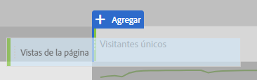
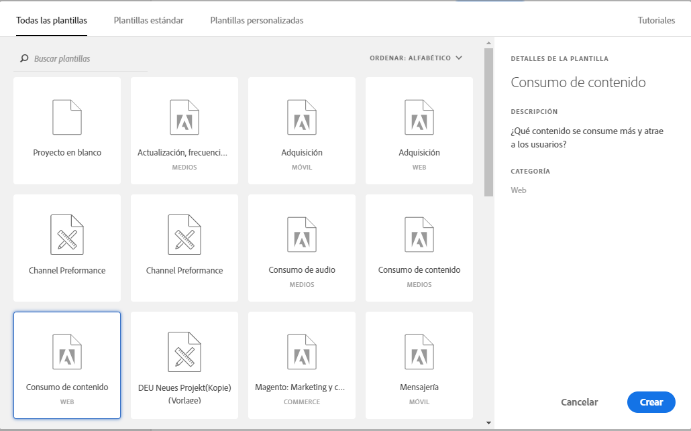

# Creación de un informe básico en Analysis Workspace para usuarios de Google Analytics

Analysis Workspace (una de las funciones principales de Adobe Analytics) proporciona un área sólida para que un usuario obtenga cualquier perspectiva sobre los datos recopilados. Los informes son muy diferentes entre Google Analytics y Adobe Analytics:

* La estructura de informes de Google Analytics permite seleccionar un tipo particular de datos, como ubicación geográfica o tráfico de referencia. La plataforma utiliza una vista de informe prefabricada basada en la mejor manera de ver esos datos.
* La estructura de informes de Analysis Workspace proporciona un lienzo en blanco, lo que proporciona mayor flexibilidad para satisfacer las necesidades exactas de los informes.

Como Analysis Workspace funciona más como un lienzo que los informes prefabricados, la recreación de informes desde Google Analytics es simplemente una cuestión de usar las visualizaciones y componentes correctos.

## Términos clave utilizados en Workspace

* **Los paneles** son los bloques principales de trabajo. En casi todos los escenarios se utiliza un panel improvisado.
* **Las visualizaciones** conforman todos los paneles improvisados. Su propósito es representar los datos en distintos formatos. La mayoría de las veces el formato es una tabla, pero otras veces pueden ser como un gráfico de líneas o anillo. Muchos informes de Google Analytics se realizan con el equivalente de dos visualizaciones: un gráfico de líneas y una tabla improvisada.
* **Los componentes** se colocan en una visualización para devolver datos. Los componentes pueden mezclarse de muchas formas diferentes para satisfacer las necesidades de los informes.
   * **Las dimensiones** son valores de variable y normalmente contienen texto. Algunos ejemplos son: nombre de página, referente o país geográfico. Se muestran generalmente como filas en una tabla.
   * **Las métricas** suelen indicar un evento o una conversión de algún tipo. Algunos ejemplos son eventos comunes como una vista de página, o algo más significativo como una compra o registro. Se suelen ver como columnas en tablas para mostrar el número de veces que se produjo el evento por dimensión.
   * **Los segmentos** son un subconjunto de los datos y se comportan de forma similar a los segmentos de Google Analytics. Permiten realizar filtros personalizados, permitiéndole centrarse en una parte concreta de los datos.
   * **Los intervalos** de fechas permiten organizar los datos cuando se produce un evento. Son el pilar de visualización de tendencias a lo largo del tiempo y generalmente se asocian con una métrica.

## Crear un informe básico en Workspace

Cree un informe Todas las páginas (similar al de Google Analytics) arrastrando los componentes adecuados a un lienzo de espacio de trabajo.

1. Log in to [experiencecloud.adobe.com](https://experiencecloud.adobe.com) using your Adobe ID credentials.
2. Haga clic en el icono 9 cuadrado en la esquina superior derecha y, a continuación, haga clic en el logotipo de color de color.
3. En la barra de navegación superior, haga clic en Espacio de trabajo.
4. Haga clic en el botón&#39;Crear nuevo proyecto &#39;.
5. En la ventana emergente modal, asegúrese de que está seleccionada la opción «Proyecto en blanco» y, a continuación, haga clic en Crear.
6. A la izquierda se muestra una lista de dimensiones, métricas, segmentos e intervalos de fechas. Busque la dimensión Páginas (naranja color) y arrástrela al lienzo rotulada «Arrastrar una dimensión aquí».
7. Se puede ver un informe que muestra las páginas principales de este mes. Analysis Workspace automatically populates the report with the [Occurrences](../../../components/c-variables/c-metrics/metrics-occurrences.md) metric.
8. Una tabla en Google Analytics suele contener 7-8 métricas. Busque la métrica Tasa de devoluciones (verde color) y arrástrela al lado del encabezado de métrica Ocurrencias. Si arrastra la métrica Tasa de devoluciones al lado de Ocurrencias, ambas métricas se muestran en paralelo.
9. Muchas métricas pueden colocarse en paralelo arrastrando métricas al lado de encabezados de métricas existentes. See [commonly used metrics](common-metrics.md) for information on how to obtain metrics typically used in Google Analytics.

   

## Comenzar con una plantilla de informe prediseñada en Workspace

Cree la plantilla Consumo de contenido (similar al informe Todas las páginas en Google Analytics) mediante el acceso a una plantilla de proyecto.

1. Haga clic en el botón&#39;Crear nuevo proyecto &#39;.
2. Busque y haga doble clic en el icono&#39;Consumo de contenido (Web)&#39; enumerado en Todas las plantillas.
3. Examine cada una de las visualizaciones prediseñadas: Flujo de página de entrada, Tabla de páginas principales, Flujo de página de salida, Flujo de sección del sitio de entrada y Tabla de secciones principales del sitio.

   

## Experimente con la herramienta

Como Analysis Workspace es una herramienta de creación de informes, no afecta a la recopilación de datos. No existen consecuencias para arrastrar componentes de forma indiscriminada a un proyecto para ver qué funciona. Arrastre diferentes combinaciones de dimensiones y métricas al proyecto de su espacio de trabajo para ver lo que está disponible para usted.

Si accidentalmente arrastra un componente no válido a su proyecto de espacio de trabajo o desea retroceder, pulse Ctrl + Z (Windows) o cmd + Z (Mac) para deshacer la última acción realizada. You can also start with a clean slate by clicking *[!UICONTROL Project] &gt; [!UICONTROL New]* in the upper left menu.

Adobe ha colocado muchas funcionalidades en Analysis Workspace en el menú contextual del clic derecho. La mayoría de las visualizaciones y componentes se puede hacer clic con el botón derecho para obtener un análisis y una interacción más detallados. Considere hacer clic con el botón derecho en los componentes del espacio de trabajo para ver las opciones disponibles.

## Comprender qué dimensiones y métricas utilizar

Si se siente cómodo con Analysis Workspace y desea volver a crear un informe específico que suele verse en Google Analytics, busque el informe en su página respectiva:

* [Informes en tiempo real](realtime-reports.md)
* [Informes de audiencia](audience-reports.md)
* [Informes de adquisición](acquisition-reports.md)
* [Informes de comportamiento](behavior-reports.md)
* [Informes Conversiones](conversions-reports.md)
