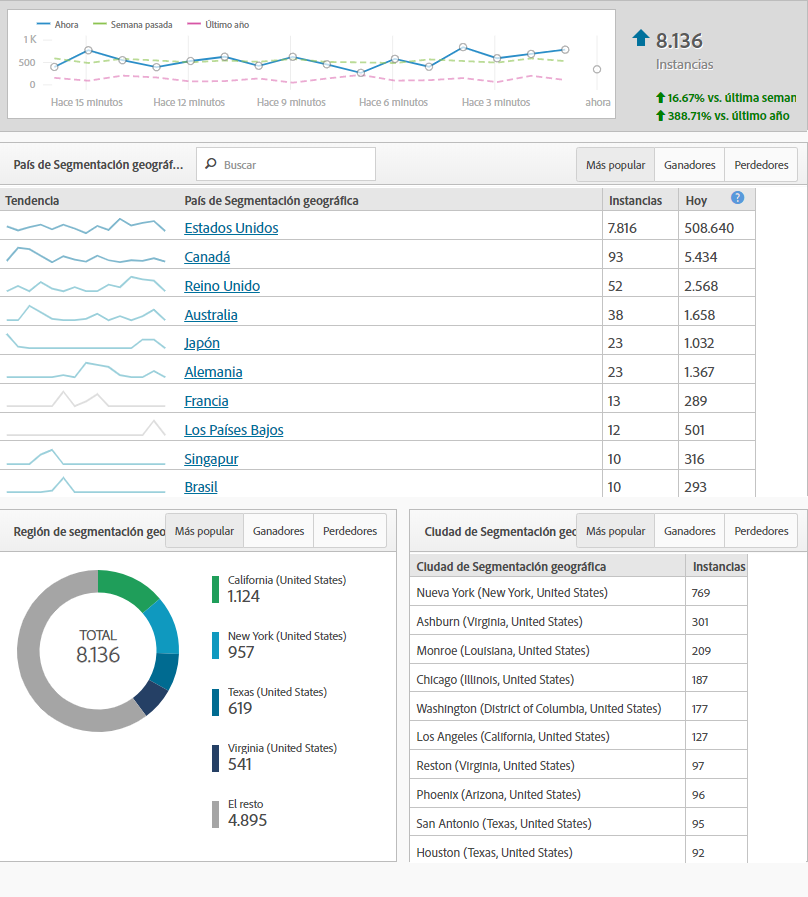

# Informes en tiempo real

Los informes en tiempo real muestran lo que está sucediendo en el sitio en este momento. Estos tipos de informes son especialmente valiosos para ver los resultados inmediatos de las actualizaciones realizadas en el sitio. Por ejemplo: una empresa que ejecuta una venta en el Black Friday puede medir el tráfico hacia páginas específicas y determinar qué ventas priorizan según el rendimiento en ese momento.

Los informes en tiempo real son una de las pocas características que aún no se han introducido en Analysis Workspace. Utilice Informes y análisis para obtener estos datos. Requieren una configuración sencilla para empezar a recopilar datos.

Para alcanzar la página de configuración de informes en tiempo real (se requieren permisos de administrador):

1. Click [!UICONTROL Reports] in the Adobe Analytics header navigation.
2. In the left menu, Click *[!UICONTROL Site Metrics]* &gt; *[!UICONTROL Real-Time]*.
3. Si el grupo de informes aún no tiene habilitada la activación en tiempo real, aparecerá un mensaje con un vínculo para configurar el grupo de informes. If the report suite has real-time enabled, click [!UICONTROL Configure] near the real-time report&#39;s title.

Adobe permite hasta tres informes en tiempo real para recopilar datos simultáneamente. Cada uno de ellos debe configurarse antes de comenzar a recopilar datos en tiempo real.

## Ubicaciones en tiempo real

Las ubicaciones en tiempo real le indican dónde residen los visitantes mientras visitan el sitio en el momento actual. Para configurar uno de los tres informes en tiempo real que muestran los datos de ubicación:

1. Click [!UICONTROL Configure] near the real-time report&#39;s title.
2. Bajo una de las ranuras de informes en tiempo real:
   * Asigne un nombre a su informe en tiempo real; por ejemplo, &quot;Ubicaciones&quot;.
   * Las instancias se utilizan normalmente como métrica. Los usuarios y Visitantes únicos no están disponibles en los informes en tiempo real en este momento.
   * En Dimensión primaria, se suele utilizar País Segmentación geográfica. Región de segmentación geográfica, DMA de EE. UU. de segmentación geográfica y Ciudad de segmentación geográfica también están disponibles.
   * Para las dos dimensiones secundarias, utilice los datos adicionales preferidos que desee ver para este tráfico. Las dimensiones secundarias no tienen que ser específicas de la ubicación.
3. Click [!UICONTROL Save and View Report].

## Fuentes de tráfico en tiempo real

Las fuentes de tráfico en tiempo real le indican dónde provienen los visitantes mientras visitan el sitio en el momento actual. Para configurar uno de los tres informes en tiempo real que muestran los datos de fuentes de tráfico:

1. Haga clic en&#39;Configurar&#39;cerca del título del informe en tiempo real.
2. Bajo una de las ranuras de informes en tiempo real:
   * Asigne un nombre a su informe en tiempo real; por ejemplo, &quot;Fuentes de tráfico&quot;.
   * Las instancias se utilizan normalmente como métrica. Los usuarios y Visitantes únicos no están disponibles en los informes en tiempo real en este momento.
   * En Dimensión principal, el dominio de referencia suele usarse. Motor de búsqueda y Palabra clave de búsqueda también están disponibles.
   * Para las dos dimensiones secundarias, utilice los datos adicionales preferidos que desee ver para este tráfico. Las dimensiones secundarias no tienen que ser específicas de las fuentes de tráfico.
3. Click [!UICONTROL Save and View Report].

## Contenido en tiempo real

El contenido en tiempo real le indica qué páginas están viendo los visitantes en ese momento. Para configurar uno de los tres informes en tiempo real que muestran los datos de contenido:

1. Click [!UICONTROL Configure] near the real-time report&#39;s title.
2. Bajo una de las ranuras de informes en tiempo real:
   * Asigne un nombre a su informe en tiempo real; por ejemplo, &quot;Contenido&quot;.
   * Las instancias se utilizan normalmente como métrica. Los usuarios y Visitantes únicos no están disponibles en los informes en tiempo real en este momento.
   * En Dimensión principal, generalmente se utiliza Página. Sección del sitio y Servidor también están disponibles si su implementación define estas variables.
   * Para las dos dimensiones secundarias, utilice los datos adicionales preferidos que desee ver para este tráfico. Las dimensiones secundarias no tienen que ser específicas del contenido.
3. Click [!UICONTROL Save and View Report].

## Eventos en tiempo real

Eventos en tiempo real le indican cuáles son los eventos que más suceden en el sitio. En Google Analytics, un evento captura el número de veces que se ha producido una acción específica (generalmente una acción que no está relacionada con una vista de página). Los eventos GA se envían con una Categoría, Etiqueta y Acción. En Adobe Analytics, los eventos personalizados son métricas que reciben nombres descriptivos en la consola de administración y pueden analizarse junto con cualquier dimensión. Si busca una dimensión en Adobe Analytics que es similar a los eventos de Google Analytics, considere la posibilidad de aplicar la dimensión Vínculo personalizado, que a menudo se utiliza como captador global para recopilar datos no relacionados con vistas de páginas (además de Vínculos de salida - Para salidas y vínculos de descarga - para descargas).

> [!NOTE] Cuando se utilizan eventos personalizados en informes en tiempo real, el valor de dimensión debe definirse en la misma visita individual que el evento personalizado. Por ejemplo, si se visualiza un evento personalizado&#39;Registros&#39;para la dimensión&#39;Dominio de referencia &#39;, no se devolverá ningún dato sin implementación adicional. Debido a que el dominio de referencia sólo aparece en la primera visita y que un evento personalizado suele aparecer más adelante en la visita, los datos no se pueden asociar en informes en tiempo real. Estos datos están disponibles mediante Analysis Workspace con latencia de procesamiento estándar, que suele ser de 30 a 90 minutos.

## Conversiones en tiempo real

Conversiones en tiempo real presentan datos de manera diferente entre plataformas. Los objetivos de Google Analytics dependen de las métricas y los eventos de éxito en Adobe Analytics. Puede utilizar la mayoría de las métricas de Adobe Analytics (métricas personalizadas como eventos de éxito y métricas estándar como ingresos) en Informes en tiempo real. De forma similar a Google Analytics, también puede aplicar dimensiones como nombre del producto, código de seguimiento y rendimiento de campañas en informes en tiempo real.

1. Click [!UICONTROL Configure] near the real-time report&#39;s title.
2. Bajo una de las ranuras de informes en tiempo real:
   * Asigne un nombre a su informe en tiempo real; por ejemplo, &quot;Conversiones&quot;.
   * Las instancias se utilizan normalmente como métrica. Los usuarios y Visitantes únicos no están disponibles en los informes en tiempo real en este momento.
   * En Dimensión principal, el código de seguimiento suele usarse. La dimensión Productos también está disponible si la implementación la utiliza.
   * Para las dos dimensiones secundarias, utilice los datos adicionales preferidos que desee ver para este tráfico. Las dimensiones secundarias no tienen que ser específicas de las conversiones.
3. Click [!UICONTROL Save and View Report].

> [!NOTE] Si se usan eventos fuera de instancias, como Pedidos, asegúrese de que la implementación define la dimensión y el evento en la misma visita. Si las dimensiones y los eventos no se activan en la misma visita, esos datos estarán disponibles en Analysis Workspace mediante latencia de procesamiento estándar, que suele ser de 30 a 90 minutos.
