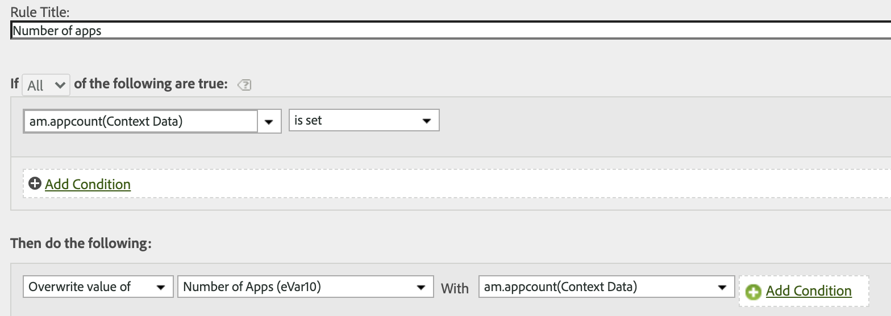
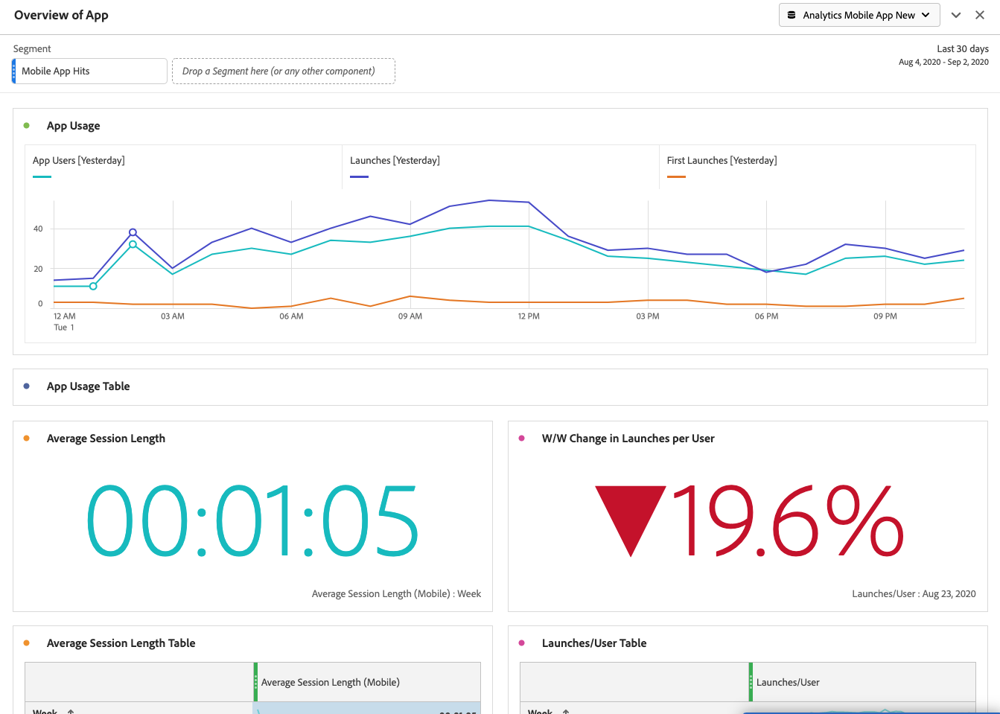

# Migración de las reglas de procesamiento de Mobile Services a Adobe Analytics

Este documento le proporciona instrucciones sobre cómo migrar cualquier regla de procesamiento adicional (más allá de las métricas del ciclo vital) que haya creado en la interfaz de usuario de Mobile Services a Adobe Analytics.

Las reglas de procesamiento se utilizan para mover valores desde variables de datos de contexto a props y eVars. Por ejemplo, puede colocar el valor de una variable de datos de contexto “término de búsqueda” en el valor de un eVar de variable de comercio y sobrescribirlo en cada visita. Sin reglas de procesamiento, las variables de datos de contexto no tienen sentido y no rellenan ningún informe en Analytics.

Este documento también muestra cómo realizar informes de uso móvil en Analysis Workspace.

## Migración de reglas de procesamiento

Si utiliza Mobile Services para funcionalidades gratuitas, como reglas de procesamiento y funciones de informes de uso, puede pasar sin problemas a la IU de Analytics (IU de reglas de procesamiento o Analysis Workspace) para llevar a cabo estas funciones. Para las métricas del ciclo vital o las reglas configuradas en la IU de las reglas de procesamiento AA, no es necesario realizar ninguna migración. Las métricas del ciclo vital son métricas “listas para usar” que se recopilan automáticamente cuando el SDK móvil se implementa por primera vez en la aplicación.

Sin embargo, si configura reglas de procesamiento adicionales en la IU de Mobile Services (más allá de las métricas del ciclo vital), debe migrarlas para que pueda editarlas o eliminarlas en Analytics después de perder el acceso a Mobile Services.

1. Inicie sesión en `experience.adobe.com` y vaya a Mobile Services.
1. Haga clic en el icono de engranaje de una aplicación móvil cuyas asignaciones de variables de contexto desee migrar a Adobe Analytics.
1. Haga clic en el elemento de menú **[!UICONTROL Administrar variables y métricas]** y luego haga clic en la pestaña **[!UICONTROL Variables personalizadas]**. Aquí puede ver qué asignaciones de variables de contexto (datos de contexto) se han agregado a la configuración. Anote estas configuraciones (o haga una captura de pantalla). Ejemplo:

   

1. En Experience Cloud, cambie a Adobe Analytics y asegúrese de que está en el mismo grupo de informes móviles que estaba viendo en Mobile Services.
1. Vaya a **[!UICONTROL Administración]** > **[!UICONTROL Grupos de informes]** > **[!UICONTROL Editar configuración]** > **[!UICONTROL General]** > **[!UICONTROL Reglas de procesamiento]**.
1. Haga clic en **[!UICONTROL Agregar regla]**.
1. Ignore las condiciones y continúe añadiendo las mismas variables de contexto que existen en Mobile Services.

   

1. Haga clic en **[!UICONTROL Guardar]**.

## Informes de uso móvil en Analysis Workspace

Además de las métricas y dimensiones móviles (si el grupo de informes está habilitado para Mobile Services), Analysis Workspace contiene varias plantillas de proyecto de Mobile que pueden facilitar el análisis:

* **[!UICONTROL Mensajería]**: Se centra en el rendimiento de la mensajería en la aplicación y push.
* **[!UICONTROL Ubicación]**: Incluye un mapa que muestra los datos de ubicación.
* **[!UICONTROL Métricas clave]**: Observe las métricas clave de su aplicación.
* **[!UICONTROL Uso de la aplicación]**: ¿Cuántos usuarios de la aplicación, ejecuciones y ejecuciones por primera vez ha tenido la aplicación, y cuál es la longitud promedio de sesión?
* **[!UICONTROL Adquisición]**: ¿Qué rendimiento tienen los vínculos de adquisición móvil?
* **[!UICONTROL Rendimiento]**: ¿Qué rendimiento tiene la aplicación y dónde tienen problemas los usuarios?
* **[!UICONTROL Retención]**: ¿Quiénes son mis usuarios más fieles y qué hacen?
* **[!UICONTROL Recorridos]**: ¿Cuáles son los patrones de uso más destacados de mi aplicación?

Aquí hay un extracto de la plantilla Uso de aplicaciones móviles:

Para acceder a las plantillas:

1. Inicie sesión en `experience.adobe.com` y seleccione Analytics.
1. Asegúrese de que está en un grupo de informes habilitado para Mobile Services.
1. Haga clic en la pestaña **[!UICONTROL Workspace]**.
1. Haga clic en **[!UICONTROL Crear nuevo proyecto]**.
1. Seleccione cualquiera de las plantillas móviles y haga clic en **[!UICONTROL Crear]**.

## Migración de otras funcionalidades de Mobile Services

La siguiente funcionalidad de Mobile Services también está vinculada a Adobe Analytics, pero requiere un SKU de Adobe Analytics adquirido:

* Vínculos de adquisición
* Mensajería push
* Mensajería en la aplicación
* Administración de puntos de interés de ubicación

Si utiliza Mobile Services para la funcionalidad de pago, no tiene una ruta de migración viable a otras herramientas internas o externas:

* Para los vínculos de adquisición, podemos dirigirle a los socios de Adobe para satisfacer sus necesidades.
* La mensajería push y en la aplicación están disponibles en Adobe Campaign Standard y Adobe Campaign Classic (solo push). Sin embargo, el conjunto de datos subyacente que se utiliza para la segmentación es diferente. Le sugerimos que contacte con su equipo de cuenta de Adobe para determinar las opciones de migración para los datos de mensajería.
* Para la funcionalidad Ubicación, se le recomienda adoptar el nuevo [Servicio de ubicación de Adobe Experience Platform](https://www.adobe.com/es/experience-platform/location-service.html), que es gratuito para todos los clientes de AEP.
