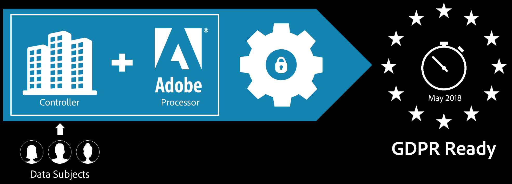

# Adobe Analytics y el RGPD

En este documento se describe lo que debe hacer en Adobe Analytics para cumplir los derechos de eliminación y acceso de sus interesados según el RGPD.

>[!IMPORTANT]
>
>El contenido de este documento no constituye asesoramiento jurídico y no está pensado para sustituir el asesoramiento jurídico. Consulte al departamento legal de su empresa para recibir consejos sobre el RGPD.

El 25 de mayo de 2018, entró en vigor el Reglamento General de Protección de Datos (RGPD) de la Unión Europea. Para obtener más información sobre la respuesta de Adobe y lo que esto supone para usted como cliente de Adobe, consulte [RGPD y tu negocio.](https://www.adobe.com/es/privacy/general-data-protection-regulation.html)

Cuando Adobe proporciona software y servicios a una empresa, Adobe actúa como encargado del tratamiento de datos de cualquier dato personal que reciba y almacene en nombre de sus clientes, como parte de la prestación de los servicios. Como procesador de datos, Adobe procesa los datos personales de acuerdo con los permisos e instrucciones que su empresa proporcione (y que pueden establecerse, por ejemplo, en el acuerdo entre su empresa y Adobe).

Como responsable del tratamiento de datos, determinará qué datos personales Adobe trata y almacena en su nombre. Si usa soluciones de Adobe Experience Cloud, Adobe podría alojar datos personales en su nombre según las soluciones que use y la información que decida enviar a su cuenta de Adobe Experience Cloud. Si desea ver una lista de ejemplos, consulte [Privacidad de Adobe Experience Cloud.](https://www.adobe.com/es/privacy/experience-cloud.html#collect)

## Cómo administra Adobe los datos del RGPD

Adobe Experience Cloud ofrece una solución integrada que conecta la infraestructura de gobernanza de datos de su marca con las herramientas de Adobe que utiliza para crear y administrar las experiencias de los consumidores. Las funciones de gobernanza de datos de Adobe Experience Cloud vinculan de forma directa las políticas de gobernanza de datos al uso de datos.

Descubra cómo Adobe Analytics [se adapta al Reglamento general de protección de datos (RGPD)](https://www.adobe.com/es/data-analytics-cloud/analytics/general-data-protection-regulation.html) y detalla los pasos de preparación para el RGPD y la integración de la API del RGPD de Adobe Experience Cloud.

## Preparación para el RGPD y sus datos de Adobe Analytics

En Adobe somos conscientes de que usted es quien más familiarizado está con los datos personalizados de sus grupos de informes y, por ello, le damos la oportunidad de definir su configuración y preferencias de gobernanza de datos.

Para ello, Adobe Analytics proporciona una interfaz de usuario de gobernanza de datos que le permite, como responsable del tratamiento de datos, establecer [etiquetas de privacidad](/help/admin/tools/privacy-labeling/labels.md#data-governance-labels) en sus grupos de informes de Analytics y en todas las dimensiones de métricas de dichos grupos. Puede identificar las columnas de su conjunto de datos que contengan datos directamente o indirectamente identificables, con lo que podrá presentar sus solicitudes de acceso y eliminación con respecto a esos datos. Para cada solicitud, se respetarán las etiquetas definidas en la interfaz de usuario de gobernanza de datos de Analytics del identificador específico con el que se corresponda dicha solicitud.

Consulte [Etiquetado de datos de grupos de informes](/help/admin/tools/privacy-labeling/labeling-overview.md) para obtener más información sobre cómo establecer las etiquetas.
